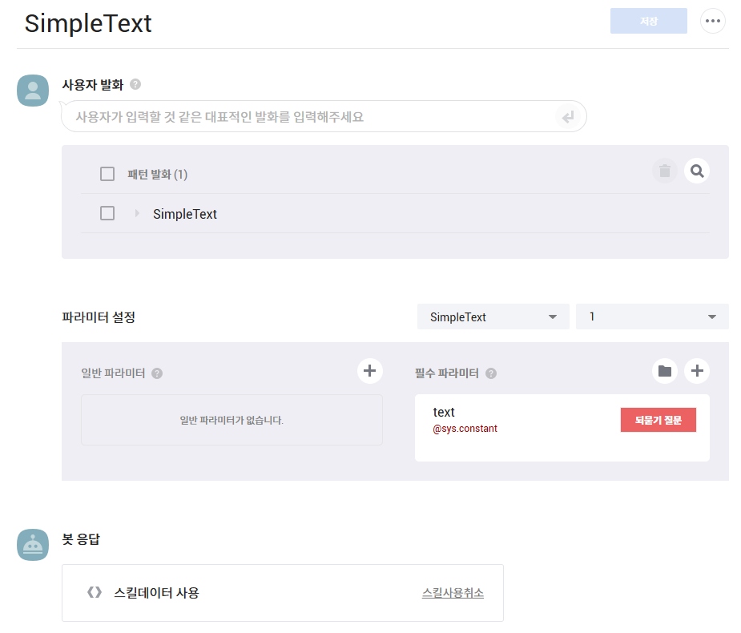
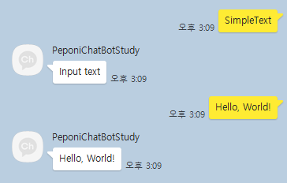
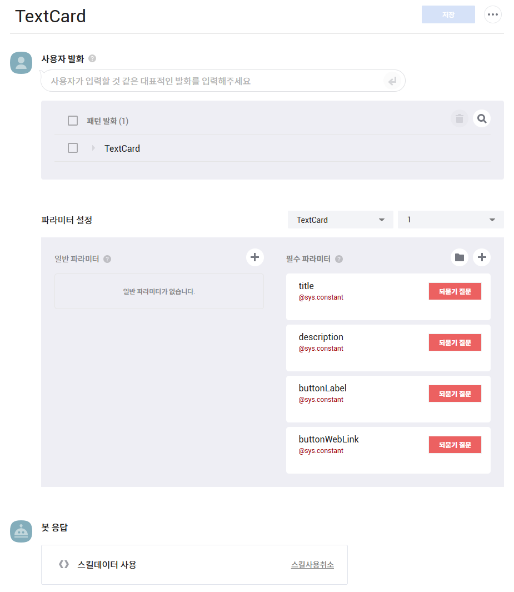
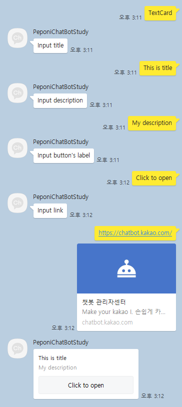

## 1. Introduction

<br>

- [카카오톡 채널 챗봇](https://kakaobusiness.gitbook.io/main/tool/chatbot/start/overview)은 카카오톡 채널을 통해 운영할 수 있다.
- 사용자의 발화에 반응하여 응답하는 [블록](https://kakaobusiness.gitbook.io/main/tool/chatbot/main_notions/block) 및 블록이 모여 하나의 서비스를 이루는 [시나리오](https://kakaobusiness.gitbook.io/main/tool/chatbot/main_notions/scenario)의 개념으로 구성되어 있다.
- 채널 운영자는 웹 UI를 통해 챗봇을 개발할 수 있으며, 사용자에게 필요한 정보를 신속히 전달할 수 있다.
- 여기서는 챗봇의 기능 중 [스킬](https://kakaobusiness.gitbook.io/main/tool/chatbot/skill_guide/make_skill)이라고 명명된 `챗봇 API`의 C# 서버 구현을 간략히 소개한다.

<br>

## 2. 스킬 서버

<br>

- 스킬 서버의 운용 시나리오는 아래와 같다.
    1. 챗봇이 스킬 서버에 `HTTP POST`로 `payload` 전달
    2. 스킬 서버가 `payload`에 대한 적절한 `response`를 반환
    3. 이 때, `content type`은 `application/json`을 사용한다.
- 아래에서는 `ASP.NET`을 이용한 서버 구현을 소개하며, API 클래스는 [ChatbotAPI](./ChatbotAPI.md) 문서에 정의된 내용을 활용한다.

<br>

## 3. 공통 - Main

<br>

- 여기서는 `application entry point` 구성을 소개한다.

```cs
namespace KakaoChatBotStudy;

public class Program
{
    public static void Main(string[] args)
    {
        var builder = WebApplication.CreateBuilder(args);

        // Add services to the container.

        builder.Services.AddControllers();

        var app = builder.Build();

        // Configure the HTTP request pipeline.

        app.UseHttpsRedirection();

        app.UseAuthorization();

        app.MapControllers();

        app.Run();
    }
}
```

<br>

## 4. SimpleText

<br>

- 여기서는 [SimpleText](https://kakaobusiness.gitbook.io/main/tool/chatbot/skill_guide/answer_json_format#simpletext)를 반환하는 서버 구현의 예시를 소개한다.
- 챗봇 블록 설정에는 사용자 입력을 받을 text 항목을 추가하였다.



```cs
// Data class

namespace KakaoChatBotStudy.Data;

public class SimpleTextData
{
    public string? Text { get; set; }
}
```
```cs
// Server

using KakaoChatBotStudy.Extension;
using KakaoChatBotStudy.KakaoAPI;
using Microsoft.AspNetCore.Mvc;

namespace KakaoChatBotStudy.Controllers;

[ApiController]
[Route("[controller]")]
public class SimpleTextTest : ControllerBase
{
    [HttpPost]
    public SkillResponse Post([FromBody] SkillPayload payload)
    {
        Console.WriteLine($"[{DateTime.Now.ToString("yyyy-MM-dd HH.mm.ss")}] Simple text requested - Request user id: {payload.UserRequest!.User!.Id}");

        SkillResponse response = new();

        try
        {
            var data = payload.Action!.Params!.ToSimpleTextData();
            var skillTemplate = new SkillTemplate
            {
                Outputs = []
            };

            SimpleText text = new() { Text = data.Text };

            skillTemplate.Outputs.AddComponent(text);
            response.Template = skillTemplate;
        }
        catch (Exception e)
        {
            Console.WriteLine(e);
        }

        return response;
    }
}
```
```cs
// Extension methods

using KakaoChatBotStudy.Data;
using KakaoChatBotStudy.KakaoAPI;

namespace KakaoChatBotStudy.Extension;

public static class UserInputDataExtension
{
    public static SimpleTextData ToSimpleTextData(this Dictionary<string, string> dic)
    {
        return new()
        {
            Text = dic[nameof(SimpleTextData.Text).ToFirstLetterLower()]
        };
    }
}

public static class SkillTemplateExtension
{
    public static void AddComponent(this List<Dictionary<string, Component>> outputs, Component component)
    {
        outputs?.Add(new() { { component.GetType().Name.ToFirstLetterLower(), component } });
    }
}
```

- 이를 이용하여 챗봇 및 서버를 실행하면 다음과 같은 결과를 얻을 수 있다.
    

<br>

## 5. TextCard

<br>

- 여기서는 [TextCard](https://kakaobusiness.gitbook.io/main/tool/chatbot/skill_guide/answer_json_format#textcard)를 반환하는 서버 구현의 예시를 소개한다.
- 챗봇 블록에는 다음 항목을 설정하여 서버에서 사용할 수 있게끔 하였다.
    1. title : `TextCard`의 `title`에 입력
    2. description : `TextCard`의 `description`에 입력
    3. buttonLabel : `TextCard`에 `Button` 추가하여 `label`에 입력
    4. buttonWebLink : `Button`의 `webLinkUrl`에 입력



```cs
// Data class

namespace KakaoChatBotStudy.Data;

public class TextCardData
{
    public string? Title { get; set; }
    public string? Description { get; set; }
    public string? ButtonLabel { get; set; }
    public string? ButtonWebLink { get; set; }
}
```
```cs
// Server

using KakaoChatBotStudy.Extension;
using KakaoChatBotStudy.KakaoAPI;
using Microsoft.AspNetCore.Mvc;

namespace KakaoChatBotStudy.Controllers;

[ApiController]
[Route("[controller]")]
public class TextCardTest : ControllerBase
{
    [HttpPost]
    public SkillResponse Post([FromBody] SkillPayload payload)
    {
        Console.WriteLine($"[{DateTime.Now.ToString("yyyy-MM-dd HH.mm.ss")}] Text card requested - Request user id: {payload.UserRequest!.User!.Id}");

        SkillResponse response = new();

        try
        {
            var data = payload.Action!.Params!.ToTextCardData();
            var skillTemplate = new SkillTemplate
            {
                Outputs = new()
            };

            TextCard card = new()
            {
                Title = data.Title,
                Description = data.Description,
                Buttons =
                [
                    new ButtonWithWebLink()
                    {
                        Label = data.ButtonLabel,
                        WebLinkUrl = data.ButtonWebLink
                    }
                ]
            };

            skillTemplate.Outputs.AddComponent(card);
            response.Template = skillTemplate;
        }
        catch (Exception e)
        {
            Console.WriteLine(e);
        }

        return response;
    }
}
```
```cs
// Extension methods

using KakaoChatBotStudy.Data;
using KakaoChatBotStudy.KakaoAPI;

namespace KakaoChatBotStudy.Extension;

public static class UserInputDataExtension
{
    public static TextCardData ToTextCardData(this Dictionary<string, string> dic)
    {
        return new()
        {
            Title = dic[nameof(TextCardData.Title).ToFirstLetterLower()],
            Description = dic[nameof(TextCardData.Description).ToFirstLetterLower()],
            ButtonLabel = dic[nameof(TextCardData.ButtonLabel).ToFirstLetterLower()],
            ButtonWebLink = dic[nameof(TextCardData.ButtonWebLink).ToFirstLetterLower()]
        };
    }
}

public static class SkillTemplateExtension
{
    public static void AddComponent(this List<Dictionary<string, Component>> outputs, Component component)
    {
        outputs?.Add(new() { { component.GetType().Name.ToFirstLetterLower(), component } });
    }
}
```

- 이를 이용하여 챗봇 및 서버를 실행하면 다음과 같은 결과를 얻을 수 있다.
    

<br>

## 6. 참조 자료

<br>

- [챗봇 관리자센터 개요](https://kakaobusiness.gitbook.io/main/tool/chatbot/start/overview)
- [블록](https://kakaobusiness.gitbook.io/main/tool/chatbot/main_notions/block)
- [시나리오](https://kakaobusiness.gitbook.io/main/tool/chatbot/main_notions/scenario)
- [스킬 만들기](https://kakaobusiness.gitbook.io/main/tool/chatbot/skill_guide/make_skill)
- [응답 타입별 JSON 포맷](https://kakaobusiness.gitbook.io/main/tool/chatbot/skill_guide/answer_json_format)
- [블록에 스킬 적용하기](https://kakaobusiness.gitbook.io/main/tool/chatbot/skill_guide/apply_skill_to_block)
- [KakaoChatBotStudy](https://github.com/peponi-paradise/C-Sharp/tree/main/Common/KakaoChatBotStudy)
- [C# - 카카오톡 챗봇 스킬 (API) 구현](https://peponi-paradise.tistory.com/entry/C-%EC%B9%B4%EC%B9%B4%EC%98%A4%ED%86%A1-%EC%B1%97%EB%B4%87-%EC%8A%A4%ED%82%AC-API)