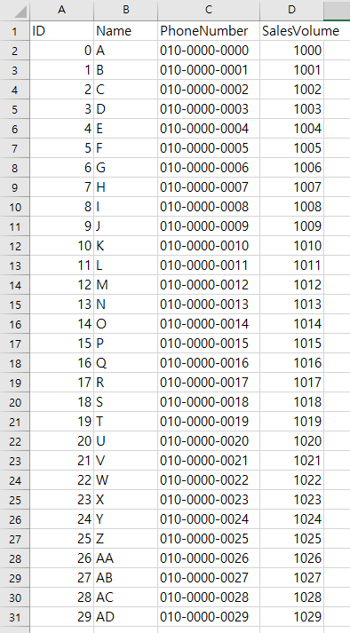
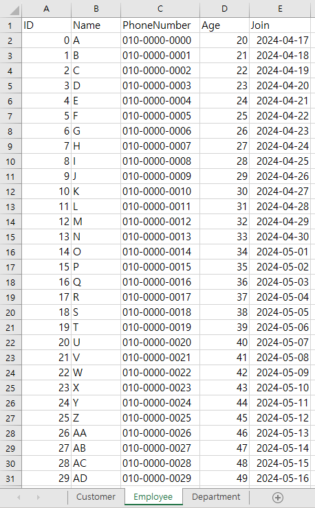
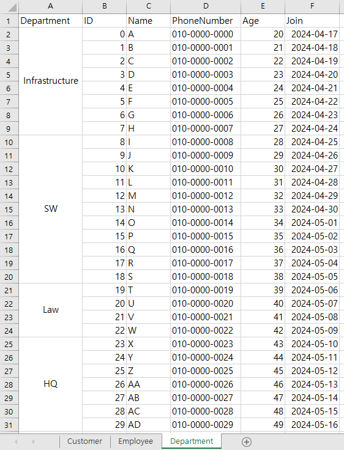
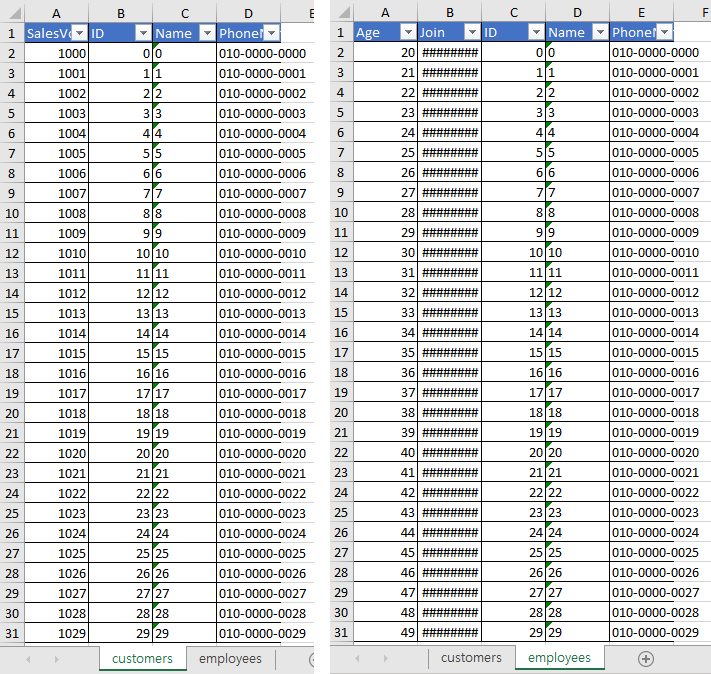
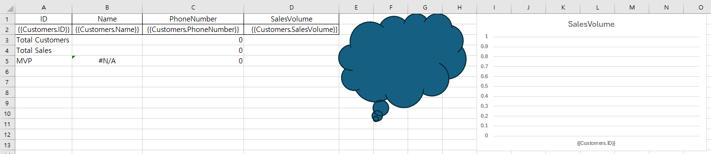
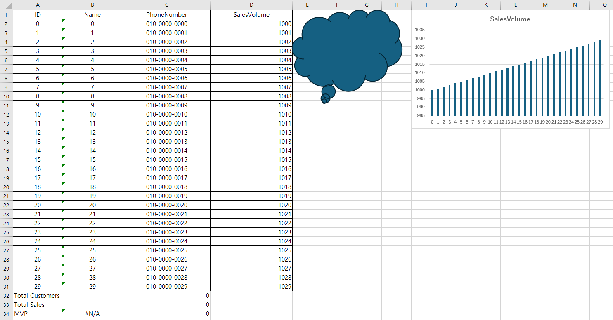

## 1. Introduction

<br>

- [MiniExcel](https://github.com/mini-software/MiniExcel)은 OOM을 피하기 위해 만들어진 .NET 라이브러리이다.
    `Github`의 Readme를 보면, 아래와 같이 라이브러리 특징에 대해 소개하고 있다.
    > Features
    > - Low memory consumption, avoid OOM (out of memory) and full GC
    > - Support operation of each row of data `real-time`
    > - Support LINQ deferred execution, it can do low-consumption, fast paging and other complex queries
    > - Lightweight, without Microsoft Office installed, no COM+, DLL size is less than 150KB
    > - Easy API style to read/write/fill excel
- Readme에 올라와 있는 벤치마크 자료를 보면 메모리 사용량이 상당히 낮은데, 속도 또한 엄청나게 빠르다는 것을 알 수 있다.
- 실제로 사용해보니 상당히 유용하게 사용할 수 있을 것으로 생각되어 자료를 정리하여 남긴다.
- 아래에서는 다음 사례에 대해 소개한다.
    1. Dynamic query
    2. Dynamic query with header
    3. Query with type
    4. Query with LINQ
    5. Query by sheet name
    6. Query with merged cells
    7. Save
    8. Save with multiple sheets
    9. Save with template
- 이 외에도 `MiniExcel`을 통해 많은 작업을 수행할 수 있다.
    관심이 있다면 꼭 한번 Github 페이지에 방문하여 자세한 사용법을 알아보길 권장한다.

<br>

## 2. Dynamic query

<br>

- 불러올 데이터는 아래와 같다.
    
- `MiniExcel.Query(string)`로 호출하며 `IEnumerable<dynamic>`을 반환한다. 
    코드 및 출력 결과는 아래와 같다.
    ```cs
    private static void DynamicQuery(string dataPath)
    {
        var datas = MiniExcel.Query(dataPath);

        foreach (var data in datas)
        {
            Console.WriteLine($"{data.A}, {data.B}, {data.C}, {data.D}");
        }
    }
    ```
    <details>
    <summary>출력 데이터 (펼치기 / 접기)</summary>

    ```text
    ID, Name, PhoneNumber, SalesVolume
    0, A, 010-0000-0000, 1000
    1, B, 010-0000-0001, 1001
    2, C, 010-0000-0002, 1002
    3, D, 010-0000-0003, 1003
    4, E, 010-0000-0004, 1004
    5, F, 010-0000-0005, 1005
    6, G, 010-0000-0006, 1006
    7, H, 010-0000-0007, 1007
    8, I, 010-0000-0008, 1008
    9, J, 010-0000-0009, 1009
    10, K, 010-0000-0010, 1010
    11, L, 010-0000-0011, 1011
    12, M, 010-0000-0012, 1012
    13, N, 010-0000-0013, 1013
    14, O, 010-0000-0014, 1014
    15, P, 010-0000-0015, 1015
    16, Q, 010-0000-0016, 1016
    17, R, 010-0000-0017, 1017
    18, S, 010-0000-0018, 1018
    19, T, 010-0000-0019, 1019
    20, U, 010-0000-0020, 1020
    21, V, 010-0000-0021, 1021
    22, W, 010-0000-0022, 1022
    23, X, 010-0000-0023, 1023
    24, Y, 010-0000-0024, 1024
    25, Z, 010-0000-0025, 1025
    26, AA, 010-0000-0026, 1026
    27, AB, 010-0000-0027, 1027
    28, AC, 010-0000-0028, 1028
    29, AD, 010-0000-0029, 1029
    ```
    </details>

<br>

## 3. Dynamic query with header

<br>

- 불러올 데이터는 아래와 같다.
    
- `MiniExcel.Query(string, true)`로 호출하며 `IEnumerable<dynamic>`을 반환한다.
    또한, 헤더 이름을 속성으로 사용하는 것이 가능해진다.
    코드 및 출력 결과는 아래와 같다.
    ```cs
    private static void DynamicQueryWithHeader(string dataPath)
    {
        var datas = MiniExcel.Query(dataPath, true);

        foreach (var data in datas)
        {
            Console.WriteLine($"{data.ID}, {data.Name}, {data.PhoneNumber}, {data.SalesVolume}");
        }
    }
    ```
    <details>
    <summary>출력 데이터 (펼치기 / 접기)</summary>

    ```text
    0, A, 010-0000-0000, 1000
    1, B, 010-0000-0001, 1001
    2, C, 010-0000-0002, 1002
    3, D, 010-0000-0003, 1003
    4, E, 010-0000-0004, 1004
    5, F, 010-0000-0005, 1005
    6, G, 010-0000-0006, 1006
    7, H, 010-0000-0007, 1007
    8, I, 010-0000-0008, 1008
    9, J, 010-0000-0009, 1009
    10, K, 010-0000-0010, 1010
    11, L, 010-0000-0011, 1011
    12, M, 010-0000-0012, 1012
    13, N, 010-0000-0013, 1013
    14, O, 010-0000-0014, 1014
    15, P, 010-0000-0015, 1015
    16, Q, 010-0000-0016, 1016
    17, R, 010-0000-0017, 1017
    18, S, 010-0000-0018, 1018
    19, T, 010-0000-0019, 1019
    20, U, 010-0000-0020, 1020
    21, V, 010-0000-0021, 1021
    22, W, 010-0000-0022, 1022
    23, X, 010-0000-0023, 1023
    24, Y, 010-0000-0024, 1024
    25, Z, 010-0000-0025, 1025
    26, AA, 010-0000-0026, 1026
    27, AB, 010-0000-0027, 1027
    28, AC, 010-0000-0028, 1028
    29, AD, 010-0000-0029, 1029
    ```
    </details>

<br>

## 4. Query with type

<br>

- 불러올 데이터는 아래와 같다.
    
- `MiniExcel.Query<T>(string)`로 호출하며 `IEnumerable<T>`를 반환한다.
    코드 및 출력 결과는 아래와 같다.
    ```cs
    public record PersonBase
    {
        public ulong ID { get; init; }
        public string? Name { get; init; }
        public string? PhoneNumber { get; init; }
    }

    public sealed record Customer : PersonBase
    {
        public ulong SalesVolume { get; init; }
    }
    ```
    ```cs
    private static void QueryWithType(string dataPath)
    {
        var datas = MiniExcel.Query<Customer>(dataPath);

        foreach (var data in datas)
        {
            Console.WriteLine($"{data.ID}, {data.Name}, {data.PhoneNumber}, {data.SalesVolume}");
        }
    }
    ```
    <details>
    <summary>출력 데이터 (펼치기 / 접기)</summary>

    ```text
    0, A, 010-0000-0000, 1000
    1, B, 010-0000-0001, 1001
    2, C, 010-0000-0002, 1002
    3, D, 010-0000-0003, 1003
    4, E, 010-0000-0004, 1004
    5, F, 010-0000-0005, 1005
    6, G, 010-0000-0006, 1006
    7, H, 010-0000-0007, 1007
    8, I, 010-0000-0008, 1008
    9, J, 010-0000-0009, 1009
    10, K, 010-0000-0010, 1010
    11, L, 010-0000-0011, 1011
    12, M, 010-0000-0012, 1012
    13, N, 010-0000-0013, 1013
    14, O, 010-0000-0014, 1014
    15, P, 010-0000-0015, 1015
    16, Q, 010-0000-0016, 1016
    17, R, 010-0000-0017, 1017
    18, S, 010-0000-0018, 1018
    19, T, 010-0000-0019, 1019
    20, U, 010-0000-0020, 1020
    21, V, 010-0000-0021, 1021
    22, W, 010-0000-0022, 1022
    23, X, 010-0000-0023, 1023
    24, Y, 010-0000-0024, 1024
    25, Z, 010-0000-0025, 1025
    26, AA, 010-0000-0026, 1026
    27, AB, 010-0000-0027, 1027
    28, AC, 010-0000-0028, 1028
    29, AD, 010-0000-0029, 1029
    ```
    </details>

<br>

## 5. Query with LINQ

<br>

- 불러올 데이터는 아래와 같다.
    
- `MiniExcel.Query<T>(string)`의 반환형이 `IEnumerable<T>`이기 때문에 `LINQ` 사용이 가능하다.
    ```cs
    private static void QueryWithLINQ(string dataPath)
    {
        var datas = MiniExcel.Query<Customer>(dataPath).Where(x => x.SalesVolume >= 1015);

        foreach (var data in datas)
        {
            Console.WriteLine($"{data.ID}, {data.Name}, {data.PhoneNumber}, {data.SalesVolume}");
        }
    }
    ```
    <details>
    <summary>출력 데이터 (펼치기 / 접기)</summary>

    ```text
    15, P, 010-0000-0015, 1015
    16, Q, 010-0000-0016, 1016
    17, R, 010-0000-0017, 1017
    18, S, 010-0000-0018, 1018
    19, T, 010-0000-0019, 1019
    20, U, 010-0000-0020, 1020
    21, V, 010-0000-0021, 1021
    22, W, 010-0000-0022, 1022
    23, X, 010-0000-0023, 1023
    24, Y, 010-0000-0024, 1024
    25, Z, 010-0000-0025, 1025
    26, AA, 010-0000-0026, 1026
    27, AB, 010-0000-0027, 1027
    28, AC, 010-0000-0028, 1028
    29, AD, 010-0000-0029, 1029
    ```
    </details>

<br>

## 6. Query by sheet name

<br>

- 엑셀 파일이 여러 sheet로 구성되어 있는 경우, `sheet name`을 이용해 해당 부분의 데이터를 불러올 수 있다.
- 불러올 데이터는 아래와 같다.
    
- 여기서는 `MiniExcel.Query<T>(string, string)`을 이용한 예시를 보여준다.
    ```cs
    public record PersonBase
    {
        public ulong ID { get; init; }
        public string? Name { get; init; }
        public string? PhoneNumber { get; init; }
    }

    public record Employee : PersonBase
    {
        public uint Age { get; init; }
        public DateTime Join { get; init; }
    }
    ```
    ```cs
    private static void QueryBySheetName(string dataPath)
    {
        var datas = MiniExcel.Query<Employee>(dataPath, nameof(Employee));

        foreach (var data in datas)
        {
            Console.WriteLine($"{data.ID}, {data.Name}, {data.PhoneNumber}, {data.Age}, {data.Join}");
        }
    }
    ```
    <details>
    <summary>출력 데이터 (펼치기 / 접기)</summary>

    ```text
    0, A, 010-0000-0000, 20, 2024-04-17 오전 12:00:00
    1, B, 010-0000-0001, 21, 2024-04-18 오전 12:00:00
    2, C, 010-0000-0002, 22, 2024-04-19 오전 12:00:00
    3, D, 010-0000-0003, 23, 2024-04-20 오전 12:00:00
    4, E, 010-0000-0004, 24, 2024-04-21 오전 12:00:00
    5, F, 010-0000-0005, 25, 2024-04-22 오전 12:00:00
    6, G, 010-0000-0006, 26, 2024-04-23 오전 12:00:00
    7, H, 010-0000-0007, 27, 2024-04-24 오전 12:00:00
    8, I, 010-0000-0008, 28, 2024-04-25 오전 12:00:00
    9, J, 010-0000-0009, 29, 2024-04-26 오전 12:00:00
    10, K, 010-0000-0010, 30, 2024-04-27 오전 12:00:00
    11, L, 010-0000-0011, 31, 2024-04-28 오전 12:00:00
    12, M, 010-0000-0012, 32, 2024-04-29 오전 12:00:00
    13, N, 010-0000-0013, 33, 2024-04-30 오전 12:00:00
    14, O, 010-0000-0014, 34, 2024-05-01 오전 12:00:00
    15, P, 010-0000-0015, 35, 2024-05-02 오전 12:00:00
    16, Q, 010-0000-0016, 36, 2024-05-03 오전 12:00:00
    17, R, 010-0000-0017, 37, 2024-05-04 오전 12:00:00
    18, S, 010-0000-0018, 38, 2024-05-05 오전 12:00:00
    19, T, 010-0000-0019, 39, 2024-05-06 오전 12:00:00
    20, U, 010-0000-0020, 40, 2024-05-07 오전 12:00:00
    21, V, 010-0000-0021, 41, 2024-05-08 오전 12:00:00
    22, W, 010-0000-0022, 42, 2024-05-09 오전 12:00:00
    23, X, 010-0000-0023, 43, 2024-05-10 오전 12:00:00
    24, Y, 010-0000-0024, 44, 2024-05-11 오전 12:00:00
    25, Z, 010-0000-0025, 45, 2024-05-12 오전 12:00:00
    26, AA, 010-0000-0026, 46, 2024-05-13 오전 12:00:00
    27, AB, 010-0000-0027, 47, 2024-05-14 오전 12:00:00
    28, AC, 010-0000-0028, 48, 2024-05-15 오전 12:00:00
    29, AD, 010-0000-0029, 49, 2024-05-16 오전 12:00:00
    ```
    </details>

<br>

## 7. Query with merged cells

<br>

- 아래 그림과 같이 병합된 셀이 있는 경우를 위해 `MiniExcel`에는 병합 셀에 대한 옵션을 지원한다.
    
- `OpenXmlConfiguration`클래스의 `FillMergedCells` 속성을 이용하여 설정 가능하다.
    코드 및 출력 결과는 아래와 같다.
    ```cs
    public record PersonBase
    {
        public ulong ID { get; init; }
        public string? Name { get; init; }
        public string? PhoneNumber { get; init; }
    }

    public record Employee : PersonBase
    {
        public uint Age { get; init; }
        public DateTime Join { get; init; }
    }

    public sealed record EmployeeWithDepartment : Employee
    {
        public string? Department { get; init; }
    }
    ```
    ```cs
    private static void QueryWithMergedCells(string dataPath)
    {
        var config = new OpenXmlConfiguration() { FillMergedCells = true };
        var datas = MiniExcel.Query<EmployeeWithDepartment>(dataPath, nameof(EmployeeWithDepartment.Department), configuration: config);

        foreach (var data in datas)
        {
            Console.WriteLine($"{data.Department}, {data.ID}, {data.Name}, {data.PhoneNumber}, {data.Age}, {data.Join}");
        }
    }
    ```
    <details>
    <summary>출력 데이터 (펼치기 / 접기)</summary>

    ```text
    Infrastructure, 0, A, 010-0000-0000, 20, 2024-04-17 오전 12:00:00
    Infrastructure, 1, B, 010-0000-0001, 21, 2024-04-18 오전 12:00:00
    Infrastructure, 2, C, 010-0000-0002, 22, 2024-04-19 오전 12:00:00
    Infrastructure, 3, D, 010-0000-0003, 23, 2024-04-20 오전 12:00:00
    Infrastructure, 4, E, 010-0000-0004, 24, 2024-04-21 오전 12:00:00
    Infrastructure, 5, F, 010-0000-0005, 25, 2024-04-22 오전 12:00:00
    Infrastructure, 6, G, 010-0000-0006, 26, 2024-04-23 오전 12:00:00
    Infrastructure, 7, H, 010-0000-0007, 27, 2024-04-24 오전 12:00:00
    SW, 8, I, 010-0000-0008, 28, 2024-04-25 오전 12:00:00
    SW, 9, J, 010-0000-0009, 29, 2024-04-26 오전 12:00:00
    SW, 10, K, 010-0000-0010, 30, 2024-04-27 오전 12:00:00
    SW, 11, L, 010-0000-0011, 31, 2024-04-28 오전 12:00:00
    SW, 12, M, 010-0000-0012, 32, 2024-04-29 오전 12:00:00
    SW, 13, N, 010-0000-0013, 33, 2024-04-30 오전 12:00:00
    SW, 14, O, 010-0000-0014, 34, 2024-05-01 오전 12:00:00
    SW, 15, P, 010-0000-0015, 35, 2024-05-02 오전 12:00:00
    SW, 16, Q, 010-0000-0016, 36, 2024-05-03 오전 12:00:00
    SW, 17, R, 010-0000-0017, 37, 2024-05-04 오전 12:00:00
    SW, 18, S, 010-0000-0018, 38, 2024-05-05 오전 12:00:00
    Law, 19, T, 010-0000-0019, 39, 2024-05-06 오전 12:00:00
    Law, 20, U, 010-0000-0020, 40, 2024-05-07 오전 12:00:00
    Law, 21, V, 010-0000-0021, 41, 2024-05-08 오전 12:00:00
    Law, 22, W, 010-0000-0022, 42, 2024-05-09 오전 12:00:00
    HQ, 23, X, 010-0000-0023, 43, 2024-05-10 오전 12:00:00
    HQ, 24, Y, 010-0000-0024, 44, 2024-05-11 오전 12:00:00
    HQ, 25, Z, 010-0000-0025, 45, 2024-05-12 오전 12:00:00
    HQ, 26, AA, 010-0000-0026, 46, 2024-05-13 오전 12:00:00
    HQ, 27, AB, 010-0000-0027, 47, 2024-05-14 오전 12:00:00
    HQ, 28, AC, 010-0000-0028, 48, 2024-05-15 오전 12:00:00
    HQ, 29, AD, 010-0000-0029, 49, 2024-05-16 오전 12:00:00
    ```
    </details>

<br>

## 8. Save

<br>

- `MiniExcel`은 일반적인 객체에 대해 상당히 쉬운 저장 방법을 제공한다.
    ```cs
    public record PersonBase
    {
        public ulong ID { get; init; }
        public string? Name { get; init; }
        public string? PhoneNumber { get; init; }
    }

    public record Employee : PersonBase
    {
        public uint Age { get; init; }
        public DateTime Join { get; init; }
    }
    ```
    ```cs
    static void Save()
    {
        List<Employee> employees = [];
        for (uint i = 0; i < 30; i++)
        {
            employees.Add(new() { ID = i, Name = i.ToString(), PhoneNumber = i.ToString("010-0000-0000"), Age = i + 20, Join = DateTime.Today.AddDays(i) });
        }

        string savePath = Path.Combine(Environment.CurrentDirectory, $"{nameof(Employee)}.xlsx");
        MiniExcel.SaveAs(savePath, employees);
    }
    ```

<br>

## 9. Save with multiple sheets

<br>

- 여러 sheet에 걸친 데이터도 쉽게 저장이 가능하다.
    ```cs
    public record PersonBase
    {
        public ulong ID { get; init; }
        public string? Name { get; init; }
        public string? PhoneNumber { get; init; }
    }

    public sealed record Customer : PersonBase
    {
        public ulong SalesVolume { get; init; }
    }

    public record Employee : PersonBase
    {
        public uint Age { get; init; }
        public DateTime Join { get; init; }
    }
    ```
    ```cs
    static void SaveWithMultipleSheets()
    {
        List<Customer> customers = [];
        List<Employee> employees = [];
        for (uint i = 0; i < 30; i++)
        {
            customers.Add(new() { ID = i, Name = i.ToString(), PhoneNumber = i.ToString("010-0000-0000"), SalesVolume = 1000 + i });
        }
        for (uint i = 0; i < 30; i++)
        {
            employees.Add(new() { ID = i, Name = i.ToString(), PhoneNumber = i.ToString("010-0000-0000"), Age = i + 20, Join = DateTime.Today.AddDays(i) });
        }

        // 각 키마다 하나의 sheet로 저장
        var multipleSheets = new Dictionary<string, object>
        {
            [nameof(customers)] = customers,
            [nameof(employees)] = employees
        };

        string savePath = Path.Combine(Environment.CurrentDirectory, $"{nameof(multipleSheets)}.xlsx");
        MiniExcel.SaveAs(savePath, multipleSheets);
    }
    ```
- 저장된 데이터는 아래와 같다.
    

<br>

## 10. Save with template

<br>

- 개인적으로는 `MiniExcel`의 가장 큰 장점 중 하나가 아닐까 싶다.
- 엑셀 파일의 내용을 템플릿화 하여 동적으로 저장하는 것이 가능해진다.
- 템플릿은 아래와 같다.
    
    - 기능 소개에 따르면 `Vue` 템플릿과 유사하다고 되어있다.
    - `{{Customers.속성}}`으로 지정되어 있는 셀 (`A2`~`D2`) 을 인식하여 자동으로 데이터를 채워준다.
    - 위 템플릿은 기능 테스트를 위해 차트와 `B5`, `C3`~`C5`에 수식이 걸려있다.
- 코드 및 출력 결과는 아래와 같다.
    ```cs
    public record PersonBase
    {
        public ulong ID { get; init; }
        public string? Name { get; init; }
        public string? PhoneNumber { get; init; }
    }

    public sealed record Customer : PersonBase
    {
        public ulong SalesVolume { get; init; }
    }
    ```
    ```cs
    private static void SaveWithTemplate()
    {
        List<Customer> customers = [];
        for (uint i = 0; i < 30; i++)
        {
            customers.Add(new() { ID = i, Name = i.ToString(), PhoneNumber = i.ToString("010-0000-0000"), SalesVolume = 1000 + i });
        }

        var saveObject = new
        {
            Customers = customers
        };

        string savePath = Path.Combine(Environment.CurrentDirectory, $"{nameof(Customer)}.xlsx");
        string templatePath = Path.Combine(Environment.CurrentDirectory, $"{nameof(Customer)}Template.xlsx");
        MiniExcel.SaveAsByTemplate(savePath, templatePath, saveObject);
    }
    ```
    
- 특이사항으로는, 차트에 걸어둔 수식은 자동으로 동작하지만 셀에 걸려있는 수식은 그렇지 않다.
    (수식을 수동으로 실행시키면 (F2, Enter) 정상 동작 한다)

<br>

## 11. 테스트를 수행한 전체 코드

<br>

- 아래는 테스트를 수행한 전체 코드이다.
    <details>
    <summary>전체 코드 (펼치기 / 접기)</summary>

    ```cs
    using MiniExcelLibs;
    using MiniExcelLibs.OpenXml;
    
    namespace MiniExcelTest
    {
        public record PersonBase
        {
            public ulong ID { get; init; }
            public string? Name { get; init; }
            public string? PhoneNumber { get; init; }
        }
    
        public sealed record Customer : PersonBase
        {
            public ulong SalesVolume { get; init; }
        }
    
        public record Employee : PersonBase
        {
            public uint Age { get; init; }
            public DateTime Join { get; init; }
        }
    
        public sealed record EmployeeWithDepartment : Employee
        {
            public string? Department { get; init; }
        }
    
        internal class Program
        {
            static void Main(string[] args)
            {
                string dataFile = "MiniExcel.xlsx";
                string dataPath = Path.Combine(Environment.CurrentDirectory, dataFile);
    
                DynamicQuery(dataPath);
    
                Console.WriteLine("----------------------------------------------------");
    
                DynamicQueryWithHeader(dataPath);
    
                Console.WriteLine("----------------------------------------------------");
    
                QueryWithType(dataPath);
    
                Console.WriteLine("----------------------------------------------------");
    
                QueryWithLINQ(dataPath);
    
                Console.WriteLine("----------------------------------------------------");
    
                QueryBySheetName(dataPath, nameof(Employee));
    
                Console.WriteLine("----------------------------------------------------");
    
                QueryWithMergedCells(dataPath, nameof(EmployeeWithDepartment.Department));
    
                Console.WriteLine("----------------------------------------------------");
    
                Save();
                SaveWithMultipleSheets();
                SaveWithTemplate();
            }
    
            static void DynamicQuery(string dataPath)
            {
                var datas = MiniExcel.Query(dataPath);
    
                foreach (var data in datas)
                {
                    Console.WriteLine($"{data.A}, {data.B}, {data.C}, {data.D}");
                }
            }
    
            static void DynamicQueryWithHeader(string dataPath)
            {
                var datas = MiniExcel.Query(dataPath, true);
    
                foreach (var data in datas)
                {
                    Console.WriteLine($"{data.ID}, {data.Name}, {data.PhoneNumber}, {data.SalesVolume}");
                }
            }
    
            static void QueryWithType(string dataPath)
            {
                var datas = MiniExcel.Query<Customer>(dataPath);
    
                foreach (var data in datas)
                {
                    Console.WriteLine($"{data.ID}, {data.Name}, {data.PhoneNumber}, {data.SalesVolume}");
                }
            }
    
            static void QueryWithLINQ(string dataPath)
            {
                var datas = MiniExcel.Query<Customer>(dataPath).Where(x => x.SalesVolume >= 1015);
    
                foreach (var data in datas)
                {
                    Console.WriteLine($"{data.ID}, {data.Name}, {data.PhoneNumber}, {data.SalesVolume}");
                }
            }
    
            static void QueryBySheetName(string dataPath, string sheetName)
            {
                var datas = MiniExcel.Query<Employee>(dataPath, sheetName);
    
                foreach (var data in datas)
                {
                    Console.WriteLine($"{data.ID}, {data.Name}, {data.PhoneNumber}, {data.Age}, {data.Join}");
                }
            }
    
            static void QueryWithMergedCells(string dataPath, string sheetName)
            {
                var config = new OpenXmlConfiguration() { FillMergedCells = true };
                var datas = MiniExcel.Query<EmployeeWithDepartment>(dataPath, sheetName, configuration: config);
    
                foreach (var data in datas)
                {
                    Console.WriteLine($"{data.Department}, {data.ID}, {data.Name}, {data.PhoneNumber}, {data.Age}, {data.Join}");
                }
            }
    
            static void Save()
            {
                List<Employee> employees = [];
                for (uint i = 0; i < 30; i++)
                {
                    employees.Add(new() { ID = i, Name = i.ToString(), PhoneNumber = i.ToString("010-0000-0000"), Age = i + 20, Join = DateTime.Today.AddDays(i) });
                }
    
                string savePath = Path.Combine(Environment.CurrentDirectory, $"{nameof(Employee)}.xlsx");
                MiniExcel.SaveAs(savePath, employees);
            }
    
            static void SaveWithMultipleSheets()
            {
                List<Customer> customers = [];
                List<Employee> employees = [];
                for (uint i = 0; i < 30; i++)
                {
                    customers.Add(new() { ID = i, Name = i.ToString(), PhoneNumber = i.ToString("010-0000-0000"), SalesVolume = 1000 + i });
                }
                for (uint i = 0; i < 30; i++)
                {
                    employees.Add(new() { ID = i, Name = i.ToString(), PhoneNumber = i.ToString("010-0000-0000"), Age = i + 20, Join = DateTime.Today.AddDays(i) });
                }
    
                // 각 키마다 하나의 sheet로 저장
                var multipleSheets = new Dictionary<string, object>
                {
                    [nameof(customers)] = customers,
                    [nameof(employees)] = employees
                };
    
                string savePath = Path.Combine(Environment.CurrentDirectory, $"{nameof(multipleSheets)}.xlsx");
                MiniExcel.SaveAs(savePath, multipleSheets);
            }
    
            static void SaveWithTemplate()
            {
                List<Customer> customers = [];
                for (uint i = 0; i < 30; i++)
                {
                    customers.Add(new() { ID = i, Name = i.ToString(), PhoneNumber = i.ToString("010-0000-0000"), SalesVolume = 1000 + i });
                }
    
                var saveObject = new
                {
                    Customers = customers
                };
    
                string savePath = Path.Combine(Environment.CurrentDirectory, $"{nameof(Customer)}.xlsx");
                string templatePath = Path.Combine(Environment.CurrentDirectory, $"{nameof(Customer)}Template.xlsx");
                MiniExcel.SaveAsByTemplate(savePath, templatePath, saveObject);
            }
        }
    }
    ```
    </details>