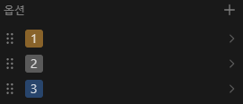

## 1. Introduction

<br>

- [Notion](https://www.notion.so)은 페이지, 데이터베이스 등에 대해 [REST](https://ko.wikipedia.org/wiki/REST) API를 지원한다.
	- API 접근을 하려면 Database 및 API 키가 필요하다.
		키를 얻는 방법에 대해서는 [Build your first integration](https://developers.notion.com/docs/create-a-notion-integration)을 참조한다.
	- Notion의 API Reference는 [NOTION API - Introduction](https://developers.notion.com/reference/intro)을 참조한다.
- 여기서는 다음 항목을 다룬다.
	1. [Retrieve a database](https://developers.notion.com/reference/retrieve-a-database)
	2. [Update a database](https://developers.notion.com/reference/update-a-database)

<br>

## 2. Database to perform

<br>

- 조회 및 업데이트 방법에 앞서, 테스트를 수행할 DB의 형태는 아래와 같다.
	
	- `선택`으로 명명되어 있는 `select` 항목의 옵션은 아래와 같다.
		
- DB 작업 수행 간 JSON 형식의 [Database object](https://developers.notion.com/reference/database)를 HTTP body에 실어 노션과 주고받게 된다.
- Reference 페이지를 참조하여 구현한 `Database object`의 형태는 아래와 같다.
	<details>
	<summary>DatabaseInformation (펼치기 / 접기)</summary>
	
	```cs
	using System.Text.Json.Serialization;

	namespace NotionAPI.Objects;

	// https://developers.notion.com/reference/database 에 따라 작성
	public class DatabaseInformation
	{
	    [JsonIgnore(Condition = JsonIgnoreCondition.WhenWritingNull)]
	    public string? @object { get; set; }

	    [JsonIgnore(Condition = JsonIgnoreCondition.WhenWritingNull)]
	    public string? id { get; set; }

	    [JsonIgnore(Condition = JsonIgnoreCondition.WhenWritingDefault)]
	    public DateTime created_time { get; set; }

	    [JsonIgnore(Condition = JsonIgnoreCondition.WhenWritingNull)]
	    public User? created_by { get; set; }

	    [JsonIgnore(Condition = JsonIgnoreCondition.WhenWritingDefault)]
	    public DateTime last_edited_time { get; set; }

	    [JsonIgnore(Condition = JsonIgnoreCondition.WhenWritingNull)]
	    public User? last_edited_by { get; set; }

	    [JsonIgnore(Condition = JsonIgnoreCondition.WhenWritingNull)]
	    public List<RichText>? title { get; set; }

	    [JsonIgnore(Condition = JsonIgnoreCondition.WhenWritingNull)]
	    public List<RichText>? description { get; set; }

	    [JsonIgnore(Condition = JsonIgnoreCondition.WhenWritingNull)]
	    public object? icon { get; set; }

	    [JsonIgnore(Condition = JsonIgnoreCondition.WhenWritingNull)]
	    public object? cover { get; set; }

	    [JsonIgnore(Condition = JsonIgnoreCondition.WhenWritingNull)]
	    public DatabaseQuery? properties { get; set; }

	    [JsonIgnore(Condition = JsonIgnoreCondition.WhenWritingNull)]
	    public Parent? parent { get; set; }

	    [JsonIgnore(Condition = JsonIgnoreCondition.WhenWritingNull)]
	    public string? url { get; set; }

	    [JsonIgnore(Condition = JsonIgnoreCondition.WhenWritingDefault)]
	    public bool archived { get; set; }

	    [JsonIgnore(Condition = JsonIgnoreCondition.WhenWritingDefault)]
	    public bool is_inline { get; set; }

	    [JsonIgnore(Condition = JsonIgnoreCondition.WhenWritingNull)]
	    public string? public_url { get; set; }
	}
	```
	</details>

<br>

## 3. Retrieve a database

<br>

- Request 및 수신 데이터에 대한 deserialize 방법은 아래와 같다.
	```cs
	using NotionAPI.Objects;
	using System.Text.Json;

	private static void Main(string[] args)
	{
	    string baseUri = "https://api.notion.com/v1/databases";
	    string databaseKey = "데이터베이스 키";
	    string APIKey = "API 키";

	    Retrieve(baseUri, databaseKey, APIKey);
	}
	```
	```cs
	private static bool Retrieve(string baseUri, string databaseKey, string APIKey)
	{
	    HttpClient client = new();

	    // https://developers.notion.com/reference/retrieve-a-database 문서 내용에 따라 Get으로 request 작성
	    var request = new HttpRequestMessage(HttpMethod.Get, $"{baseUri}/{databaseKey}");
	    request.Headers.Add("Authorization", $"Bearer {APIKey}");
	    request.Headers.Add("Notion-Version", "2022-06-28");

	    var response = client.Send(request);

	    // StatusCode를 포함한 Header 출력
	    Console.WriteLine(response);
	    // JSON 형식의 Body 출력
	    var content = new StreamReader(response.Content.ReadAsStream()).ReadToEnd();
	    Console.WriteLine(content);

	    // Parsing
	    var parsed = JsonSerializer.Deserialize<DatabaseInformation>(content);

	    return response.StatusCode == System.Net.HttpStatusCode.OK;
	}
	```
- 수신되는 데이터는 아래와 같다.
	<details>
	<summary>Header (펼치기 / 접기)</summary>

	```text
	StatusCode: 200, ReasonPhrase: 'OK', Version: 1.1, Content: System.Net.Http.HttpConnectionResponseContent, Headers:
	{
  		Date: Mon, 08 Apr 2024 21:44:07 GMT
  		Transfer-Encoding: chunked
  		Connection: keep-alive
  		X-Powered-By: Express
  		x-notion-request-id: 69ac934d-19e3-4f61-a203-97d3d7163c25
  		ETag: W/"43f-jWb6i+31Pzu1P41blZV4YpBeLUU"
  		Vary: Accept-Encoding
  		CF-Cache-Status: DYNAMIC
  		Set-Cookie: __cf_bm=VzFf9FGzlRxJAsPL30Fo1lXbWNsSzpdb6MDCXadZj4g-1712612647-1.0.1.1-MX4uj538aCBZoXKkrEWDNmUHE4DKgt_kV2NJiP0P8eThI8jirGHBnNRxI5fTmYSqqY0C7pe3rbGafsEUVINNSg; path=/; expires=Mon, 08-Apr-24 22:14:07 GMT; domain=.notion.com; HttpOnly; Secure
  		Server: cloudflare
  		CF-RAY: 87156fd3ab33315e-ICN
  		Content-Type: application/json; charset=utf-8
	}
	```
	</details>
	<details>
	<summary>Body (펼치기 / 접기)</summary>

	```json
	{
	  "object": "database",
	  "id": "DB id",
	  "cover": null,
	  "icon": null,
	  "created_time": "2024-04-03T22:03:00.000Z",
	  "created_by": {
	    "object": "user",
	    "id": "유저 id"
	  },
	  "last_edited_by": {
	    "object": "user",
	    "id": "유저 id"
	  },
	  "last_edited_time": "2024-04-05T00:52:00.000Z",
	  "title": [
	    {
	      "type": "text",
	      "text": {
	        "content": "TestDataBase",
	        "link": null
	      },
	      "annotations": {
	        "bold": false,
	        "italic": false,
	        "strikethrough": false,
	        "underline": false,
	        "code": false,
	        "color": "default"
	      },
	      "plain_text": "TestDataBase",
	      "href": null
	    }
	  ],
	  "description": [],
	  "is_inline": false,
	  "properties": {
	    "선택": {
	      "id": "sKnP",
	      "name": "선택",
	      "type": "select",
	      "select": {
	        "options": [
	          {
	            "id": "vNQJ",
	            "name": "2",
	            "color": "gray",
	            "description": null
	          },
	          {
	            "id": "nvSy",
	            "name": "1",
	            "color": "yellow",
	            "description": null
	          }
	        ]
	      }
	    },
	    "이름": {
	      "id": "title",
	      "name": "이름",
	      "type": "title",
	      "title": {}
	    }
	  },
	  "parent": {
	    "type": "workspace",
	    "workspace": true
	  },
	  "url": "https://www.notion.so/데이터베이스 키",
	  "public_url": null,
	  "archived": false,
	  "in_trash": false,
	  "request_id": "69ac934d-19e3-4f61-a203-97d3d7163c25"
	}
	```
	</details>

<br>

## 4. Update a database

<br>

- 아래는 DB의 `select` 항목에 `3` 옵션을 추가하는 간단한 예시이다.
- 정상적으로 옵션이 추가되는 경우 `HttpStatusCode.OK`를 반환하며 변경된 데이터베이스 정보를 body에 실어 보내준다.
	```cs
	using NotionAPI.Objects;
	using System.Net.Http.Json;
	using System.Text.Json;

	private static void Main(string[] args)
	{
	    string baseUri = "https://api.notion.com/v1/databases";
	    string databaseKey = "데이터베이스 키";
	    string APIKey = "API 키";

	    Update(baseUri, databaseKey, APIKey);
	}
	```
	```cs
	private static bool Update(string baseUri, string databaseKey, string APIKey)
	{
	    HttpClient client = new();

	    // https://developers.notion.com/reference/update-a-database 문서 내용에 따라 Patch로 request 작성
	    var patchRequest = new HttpRequestMessage(HttpMethod.Patch, $"{baseUri}/{databaseKey}");
	    patchRequest.Headers.Add("Authorization", $"Bearer {APIKey}");
	    patchRequest.Headers.Add("Notion-Version", "2022-06-28");

	    // select에 '3' 옵션 추가
	    var information = new DatabaseInformation();
	    var property = new DatabaseQuery();
	    property.선택 = new();
	    property.선택.select = new();
	    property.선택.select.options = new();

	    // 기존 옵션 정보 추가 (덮어쓰기 형태로 동작)
	    for (int index = 1; index < 3; index++)
	    {
	        property.선택.select.options.Add(new() { name = index.ToString() });
	    }
	    property.선택.select.options.Add(new() { name = "3", color = "blue" });

	    information.properties = property;
	    patchRequest.Content = JsonContent.Create(information);

	    var response = client.Send(patchRequest);

	    // StatusCode를 포함한 Header 출력
	    Console.WriteLine(response);
	    // JSON 형식의 Body 출력
	    var content = new StreamReader(response.Content.ReadAsStream()).ReadToEnd();
	    Console.WriteLine(content);

	    return response.StatusCode == System.Net.HttpStatusCode.OK;
	}
	```
- 옵션이 추가되면 UI에 자동 반영되며, 수신되는 데이터는 아래와 같다.
	
	<details>
	<summary>Header (펼치기 / 접기)</summary>

	```text
	StatusCode: 200, ReasonPhrase: 'OK', Version: 1.1, Content: System.Net.Http.HttpConnectionResponseContent, Headers:
	{
	  	Date: Mon, 08 Apr 2024 22:39:54 GMT
	  	Transfer-Encoding: chunked
	  	Connection: keep-alive
	  	X-Powered-By: Express
	  	x-notion-request-id: 9ada832f-ef24-4d78-98fe-354c052533b0
	  	ETag: W/"49a-NktLub6K767pqgH+bW/fNXXy148"
	  	Vary: Accept-Encoding
	  	CF-Cache-Status: DYNAMIC
	  	Set-Cookie: __cf_bm=BrD6Jt77uM8XW3CLTFV.R4gC1vVwFxYxcaNmOztMJvg-1712615994-1.0.1.1-rllYRf.IImzPK9cyfzMB1BC8eUaOgAflI1gepQ0ik.3RQAasr.B.VBnqGDBJbkPT5AtbAcFAiy23dWe0Wr2pQw; path=/; expires=Mon, 08-Apr-24 23:09:54 GMT; domain=.notion.com; HttpOnly; Secure
  		Server: cloudflare
  		CF-RAY: 8715c1883c7a311b-ICN
  		Content-Type: application/json; charset=utf-8
	}
	```
	</details>
	<details>
	<summary>Body (펼치기 / 접기)</summary>

	```json
	{
	  "object": "database",
	  "id": "DB id",
	  "cover": null,
	  "icon": null,
	  "created_time": "2024-04-03T22:03:00.000Z",
	  "created_by": {
	    "object": "user",
	    "id": "유저 id"
	  },
	  "last_edited_by": {
	    "object": "user",
	    "id": "유저 id"
	  },
	  "last_edited_time": "2024-04-08T22:39:00.000Z",
	  "title": [
	    {
	      "type": "text",
	      "text": {
	        "content": "TestDataBase",
	        "link": null
	      },
	      "annotations": {
	        "bold": false,
	        "italic": false,
	        "strikethrough": false,
	        "underline": false,
	        "code": false,
	        "color": "default"
	      },
	      "plain_text": "TestDataBase",
	      "href": null
	    }
	  ],
	  "description": [],
	  "is_inline": false,
	  "properties": {
	    "선택": {
	      "id": "sKnP",
	      "name": "선택",
	      "type": "select",
	      "select": {
	        "options": [
	          {
	            "id": "@:oT",
	            "name": "1",
	            "color": "yellow",
	            "description": null
	          },
	          {
	            "id": "CsLi",
	            "name": "2",
	            "color": "gray",
	            "description": null
	          },
	          {
	            "id": "9a1c5714-22f3-47dd-93af-633343cd2bb9",
	            "name": "3",
	            "color": "blue",
	            "description": null
	          }
	        ]
	      }
	    },
	    "이름": {
	      "id": "title",
	      "name": "이름",
	      "type": "title",
	      "title": {}
	    }
	  },
	  "parent": {
	    "type": "workspace",
	    "workspace": true
	  },
	  "url": "https://www.notion.so/데이터베이스 키",
	  "public_url": null,
	  "archived": false,
	  "in_trash": false,
	  "request_id": "9ada832f-ef24-4d78-98fe-354c052533b0"
	}
	```
	</details>

<br>

### 4.1. Retrieve and update

<br>

- 만약 옵션을 알지 못하는 경우 DB 조회 후 옵션을 추가할 수 있다.
	```cs
	using NotionAPI.Objects;
	using System.Net.Http.Json;
	using System.Text.Json;

	private static void Main(string[] args)
	{
	    string baseUri = "https://api.notion.com/v1/databases";
	    string databaseKey = "데이터베이스 키";
	    string APIKey = "API 키";

	    RetrieveAndUpdate(baseUri, databaseKey, APIKey);
	}
	```
	```cs
	private static bool RetrieveAndUpdate(string baseUri, string databaseKey, string APIKey)
	{
	    // 기존 select 정보를 얻기 위해 데이터베이스 정보를 얻어옴
	    HttpClient client = new();

	    // https://developers.notion.com/reference/retrieve-a-database 문서 내용에 따라 Get으로 request 작성
	    var getRequest = new HttpRequestMessage(HttpMethod.Get, $"{baseUri}/{databaseKey}");
	    getRequest.Headers.Add("Authorization", $"Bearer {APIKey}");
	    getRequest.Headers.Add("Notion-Version", "2022-06-28");

	    var response = client.Send(getRequest);
	    var content = new StreamReader(response.Content.ReadAsStream()).ReadToEnd();

	    // https://developers.notion.com/reference/update-a-database 문서 내용에 따라 Patch로 request 작성
	    var patchRequest = new HttpRequestMessage(HttpMethod.Patch, $"{baseUri}/{databaseKey}");
	    patchRequest.Headers.Add("Authorization", $"Bearer {APIKey}");
	    patchRequest.Headers.Add("Notion-Version", "2022-06-28");

	    // Parsing 후 select에 '3' 옵션 추가
	    var parsed = JsonSerializer.Deserialize<DatabaseInformation>(content);
	    if (parsed is not null)
	    {
	        var information = new DatabaseInformation();
	        var property = new DatabaseQuery();
	        property.선택 = new();
	        property.선택.select = new();
	        property.선택.select.options = new();

	        foreach (var select in parsed.properties!.선택!.select!.options!)
	        {
	            property.선택.select.options.Add(new Select() { name = select.name });
	        }
	        property.선택.select.options.Add(new() { name = "3", color = "blue" });

	        information.properties = property;
	        patchRequest.Content = JsonContent.Create(information);
	    }

	    response = client.Send(patchRequest);

	    // StatusCode를 포함한 Header 출력
	    Console.WriteLine(response);
	    // JSON 형식의 Body 출력
	    content = new StreamReader(response.Content.ReadAsStream()).ReadToEnd();
	    Console.WriteLine(content);

	    return response.StatusCode == System.Net.HttpStatusCode.OK;
	}
	```
- 옵션이 추가되면 UI에 자동 반영되며, 수신되는 데이터는 아래와 같다.
	
	<details>
	<summary>Header (펼치기 / 접기)</summary>

	```text
	StatusCode: 200, ReasonPhrase: 'OK', Version: 1.1, Content: System.Net.Http.HttpConnectionResponseContent, Headers:
	{
	  	Date: Mon, 08 Apr 2024 22:45:15 GMT
	  	Transfer-Encoding: chunked
	  	Connection: keep-alive
	  	X-Powered-By: Express
	  	x-notion-request-id: 82d93896-78af-4bcb-b842-aa620174a0c5
	  	ETag: W/"49a-VeWAFQBnQeq9gUUUdT888JwL8RA"
	  	Vary: Accept-Encoding
	  	CF-Cache-Status: DYNAMIC
	  	Server: cloudflare
	  	CF-RAY: 8715c947ead48b67-ICN
	  	Content-Type: application/json; charset=utf-8
	}
	```
	</details>
	<details>
	<summary>Body (펼치기 / 접기)</summary>

	```json
	{
	  "object": "database",
	  "id": "DB id",
	  "cover": null,
	  "icon": null,
	  "created_time": "2024-04-03T22:03:00.000Z",
	  "created_by": {
	    "object": "user",
	    "id": "유저 id"
	  },
	  "last_edited_by": {
	    "object": "user",
	    "id": "유저 id"
	  },
	  "last_edited_time": "2024-04-08T22:45:00.000Z",
	  "title": [
	    {
	      "type": "text",
	      "text": {
	        "content": "TestDataBase",
	        "link": null
	      },
	      "annotations": {
	        "bold": false,
	        "italic": false,
	        "strikethrough": false,
	        "underline": false,
	        "code": false,
	        "color": "default"
	      },
	      "plain_text": "TestDataBase",
	      "href": null
	    }
	  ],
	  "description": [],
	  "is_inline": false,
	  "properties": {
	    "선택": {
	      "id": "sKnP",
	      "name": "선택",
	      "type": "select",
	      "select": {
	        "options": [
	          {
	            "id": "@:oT",
	            "name": "1",
	            "color": "yellow",
	            "description": null
	          },
	          {
	            "id": "CsLi",
	            "name": "2",
	            "color": "gray",
	            "description": null
	          },
	          {
	            "id": "92324ab1-fa22-4b2c-b876-6e30116fe80b",
	            "name": "3",
	            "color": "blue",
	            "description": null
	          }
	        ]
	      }
	    },
	    "이름": {
	      "id": "title",
	      "name": "이름",
	      "type": "title",
	      "title": {}
	    }
	  },
	  "parent": {
	    "type": "workspace",
	    "workspace": true
	  },
	  "url": "https://www.notion.so/데이터베이스 키",
	  "public_url": null,
	  "archived": false,
	  "in_trash": false,
	  "request_id": "82d93896-78af-4bcb-b842-aa620174a0c5"
	}
	```
	</details>

<br>

## 5. 참조 자료

<br>

- [NOTION API - Introduction](https://developers.notion.com/reference/intro)
- [Build your first integration](https://developers.notion.com/docs/create-a-notion-integration)
- [Retrieve a database](https://developers.notion.com/reference/retrieve-a-database)
- [Update a database](https://developers.notion.com/reference/update-a-database)
- [System.Text.Json을 사용하여 속성을 무시하는 방법](https://learn.microsoft.com/ko-kr/dotnet/standard/serialization/system-text-json/ignore-properties)