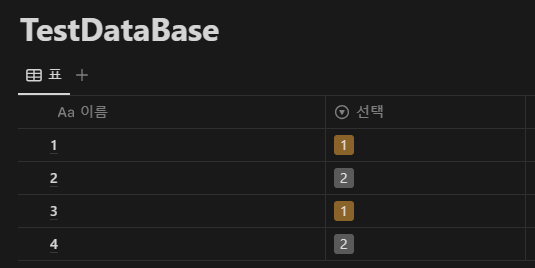

## 1. Introduction

<br>

- [Notion](https://www.notion.so)은 페이지, 데이터베이스 등에 대해 [REST](https://ko.wikipedia.org/wiki/REST) API를 지원한다.
	- API 접근을 하려면 Database 및 API 키가 필요하다.
		키를 얻는 방법에 대해서는 [Build your first integration](https://developers.notion.com/docs/create-a-notion-integration)을 참조한다.
	- Notion의 API Reference는 [NOTION API - Introduction](https://developers.notion.com/reference/intro)을 참조한다.
- 여기서는 다음 항목을 다룬다.
	1. [Query a database](https://developers.notion.com/reference/post-database-query)
	2. [Paginated query](https://developers.notion.com/reference/intro#pagination)
	3. [Filter database entries](https://developers.notion.com/reference/post-database-query-filter)

<br>

## 2. Database to perform

<br>

- DB 조회 및 필터 방법에 앞서, 테스트를 수행할 DB의 형태는 아래와 같다.
	
	- `선택`으로 명명되어 있는 `select` 항목의 옵션은 아래와 같다.
		
- DB 작업 수행 간 JSON 형식의 [Response object](https://developers.notion.com/reference/intro#responses)를 HTTP body에 실어 전송받게 된다.
- Reference 페이지를 참조하여 구현한 JSON object의 형태는 아래와 같다.
	<details>
	<summary>Response (펼치기 / 접기)</summary>

	```cs
	using NotionAPI.Objects;

	namespace NotionAPI;

	// https://developers.notion.com/reference/intro#responses 에 따라 작성
	public class NotionResponse
	{
	    // 추가로 더 읽을 수 있는 데이터가 있는지
	    public bool has_more { get; set; }

	    // has_more가 true인 경우 다음 시작점
	    public string? next_cursor { get; set; }

	    public string? @object { get; set; }

	    // 데이터가 들어감
	    public List<PageInformation>? results { get; set; }

	    // results의 데이터 형식
	    public string? type { get; set; }
	}
	```
	</details>
	<details>
	<summary>Paginated request (펼치기 / 접기)</summary>

	```cs
	using System.Text.Json.Serialization;

	using NotionAPI.Objects;
	
	namespace NotionAPI;

	// https://developers.notion.com/reference/intro#parameters-for-paginated-requests 에 따라 작성
	public class PaginatedRequest
	{
	    // 기본값 및 최대값은 100
	    [JsonIgnore(Condition = JsonIgnoreCondition.WhenWritingDefault)]
	    public int page_size { get; set; }

	    // 시작점이 정의되지 않으면 처음부터 조회
	    [JsonIgnore(Condition = JsonIgnoreCondition.WhenWritingNull)]
	    public string? start_cursor { get; set; }
	}
	```
	</details>
	<details>
	<summary>PageInformation (펼치기 / 접기)</summary>

	```cs
	using System.Text.Json.Serialization;

	namespace NotionAPI.Objects;

	// https://developers.notion.com/reference/page 에 따라 작성
	public class PageInformation
	{
	    [JsonIgnore(Condition = JsonIgnoreCondition.WhenWritingNull)]
	    public string? @object { get; set; }

	    [JsonIgnore(Condition = JsonIgnoreCondition.WhenWritingNull)]
	    public string? id { get; set; }

	    [JsonIgnore(Condition = JsonIgnoreCondition.WhenWritingDefault)]
	    public DateTime created_time { get; set; }

	    [JsonIgnore(Condition = JsonIgnoreCondition.WhenWritingNull)]
	    public User? created_by { get; set; }

	    [JsonIgnore(Condition = JsonIgnoreCondition.WhenWritingDefault)]
	    public DateTime last_edited_time { get; set; }

	    [JsonIgnore(Condition = JsonIgnoreCondition.WhenWritingNull)]
	    public User? last_edited_by { get; set; }

	    [JsonIgnore(Condition = JsonIgnoreCondition.WhenWritingDefault)]
	    public bool archived { get; set; }

	    [JsonIgnore(Condition = JsonIgnoreCondition.WhenWritingNull)]
	    public object? icon { get; set; }

	    [JsonIgnore(Condition = JsonIgnoreCondition.WhenWritingNull)]
	    public object? cover { get; set; }

	    [JsonIgnore(Condition = JsonIgnoreCondition.WhenWritingNull)]
	    public Dictionary<string, PageProperty>? properties { get; set; }

	    [JsonIgnore(Condition = JsonIgnoreCondition.WhenWritingNull)]
	    public Parent? parent { get; set; }

	    [JsonIgnore(Condition = JsonIgnoreCondition.WhenWritingNull)]
	    public string? url { get; set; }

	    [JsonIgnore(Condition = JsonIgnoreCondition.WhenWritingNull)]
	    public string? public_url { get; set; }
	}
	```
	</details>
	<details>
	<summary>PageProperty (펼치기 / 접기)</summary>

	```cs
	using System.Text.Json;
	using System.Text.Json.Serialization;

	namespace NotionAPI.Objects;

	// https://developers.notion.com/reference/page-property-values 에 따라 작성
	[JsonConverter(typeof(PagePropertyConverter))]
	public class PageProperty
	{
	    [JsonIgnore(Condition = JsonIgnoreCondition.WhenWritingNull)]
	    public string? id { get; set; }
	}

	public sealed class PageSelect : PageProperty
	{
	    public Select? select { get; set; }
	}

	public sealed class PageTitle : PageProperty
	{
	    public List<RichText>? title { get; set; }
	}

	public class PagePropertyConverter : JsonConverter<PageProperty>
	{
	    public override PageProperty? Read(ref Utf8JsonReader reader, Type typeToConvert, JsonSerializerOptions options)
	    {
	        var jsonDoc = JsonDocument.ParseValue(ref reader);
	        if (jsonDoc.RootElement.TryGetProperty("type", out var typeName))
	        {
	            return typeName.GetString() switch
	            {
	                "select" => JsonSerializer.Deserialize<PageSelect>(jsonDoc),
	                "title" => JsonSerializer.Deserialize<PageTitle>(jsonDoc),
	                _ => null
	            };
	        }

	        return null;
	    }

	    public override void Write(Utf8JsonWriter writer, PageProperty value, JsonSerializerOptions options)
	    {
	        switch (value)
	        {
	            case PageSelect select:
	                JsonSerializer.Serialize(writer, select);
	                break;

	            case PageTitle title:
	                JsonSerializer.Serialize(writer, title);
	                break;
	        }
	    }
	}
	```
	</details>
	<details>
	<summary>User (펼치기 / 접기)</summary>

	```cs
	using System.Text.Json.Serialization;

	namespace NotionAPI.Objects;

	// https://developers.notion.com/reference/user 에 따라 작성
	[JsonPolymorphic(TypeDiscriminatorPropertyName = "type")]
	[JsonDerivedType(typeof(People), typeDiscriminator: "person")]
	[JsonDerivedType(typeof(Bots), typeDiscriminator: "bot")]
	public class User
	{
	    public string? @object { get; set; }
	    public string? id { get; set; }
	    public string? name { get; set; }
	    public string? avatar_url { get; set; }
	}

	public sealed class People : User
	{
	    public object? person { get; set; }
	}

	public sealed class Bots : User
	{
	    public object? bot { get; set; }
	}
	```
	</details>
	<details>
	<summary>Parent (펼치기 / 접기)</summary>

	```cs
	using System.Text.Json.Serialization;

	namespace NotionAPI.Objects;

	// https://developers.notion.com/reference/parent-object 에 따라 작성
	[JsonPolymorphic(TypeDiscriminatorPropertyName = "type")]
	[JsonDerivedType(typeof(DatabaseParent), typeDiscriminator: "database_id")]
	[JsonDerivedType(typeof(PageParent), typeDiscriminator: "page_id")]
	[JsonDerivedType(typeof(WorkspaceParent), typeDiscriminator: "workspace")]
	[JsonDerivedType(typeof(BlockParent), typeDiscriminator: "block_id")]
	public class Parent
	{
	}

	public sealed class DatabaseParent : Parent
	{
	    public string? database_id { get; set; }
	}

	public sealed class PageParent : Parent
	{
	    public string? page_id { get; set; }
	}

	public sealed class WorkspaceParent : Parent
	{
	    public bool workspace { get; set; } = true;
	}

	public sealed class BlockParent : Parent
	{
	    public string? block_id { get; set; }
	}
	```
	</details>
	<details>
	<summary>RichText (펼치기 / 접기)</summary>

	```cs
	using System.Text.Json.Serialization;

	namespace NotionAPI.Objects;

	// https://developers.notion.com/reference/rich-text 에 따라 작성
	[JsonPolymorphic(TypeDiscriminatorPropertyName = "type")]
	[JsonDerivedType(typeof(RichTextWithText), typeDiscriminator: "text")]
	[JsonDerivedType(typeof(RichTextWithMention), typeDiscriminator: "mention")]
	[JsonDerivedType(typeof(RichTextWithEquation), typeDiscriminator: "equation")]
	public class RichText
	{
	    [JsonIgnore(Condition = JsonIgnoreCondition.WhenWritingNull)]
	    public Annotations? annotations { get; set; }

	    [JsonIgnore(Condition = JsonIgnoreCondition.WhenWritingNull)]
	    public string? plain_text { get; set; }

	    [JsonIgnore(Condition = JsonIgnoreCondition.WhenWritingNull)]
	    public string? href { get; set; }
	}

	public sealed class RichTextWithText : RichText
	{
	    public Text? text { get; set; }
	}

	public sealed class RichTextWithMention : RichText
	{
	    public object? mention { get; set; }
	}

	public sealed class RichTextWithEquation : RichText
	{
	    public object? equation { get; set; }
	}

	public class Annotations
	{
	    public bool bold { get; set; }
	    public bool italic { get; set; }
	    public bool strikethrough { get; set; }
	    public bool underline { get; set; }
	    public bool code { get; set; }
	    public string? color { get; set; } = "default";
	}

	public class Text
	{
	    public string? content { get; set; }

	    [JsonIgnore(Condition = JsonIgnoreCondition.WhenWritingNull)]
	    public Link? link { get; set; }
	}

	public class Link
	{
	    public string? url { get; set; }
	}
	```
	</details>
	<details>
	<summary>Select (펼치기 / 접기)</summary>

	```cs
	using System.Text.Json.Serialization;

	namespace NotionAPI.Objects;

	// https://developers.notion.com/reference/property-object#select 에 따라 작성
	public class Select
	{
	    [JsonIgnore(Condition = JsonIgnoreCondition.WhenWritingNull)]
	    public string? id { get; set; }

	    public string? name { get; set; }

	    [JsonIgnore(Condition = JsonIgnoreCondition.WhenWritingNull)]
	    public string? color { get; set; }
	}
	```
	</details>
	<details>
	<summary>Filter (펼치기 / 접기)</summary>

	```cs
	using System.Text.Json.Serialization;

	namespace NotionAPI.Objects;

	// https://developers.notion.com/reference/post-database-query 에 따라 작성
	public class DatabaseFilterEntry
	{
	    public DatabaseFilter? filter { get; set; }
	}

	public class DatabaseFilter
	{
	    [JsonIgnore(Condition = JsonIgnoreCondition.WhenWritingNull)]
	    public List<DatabaseFilter>? and { get; set; }

	    [JsonIgnore(Condition = JsonIgnoreCondition.WhenWritingNull)]
	    public List<DatabaseFilter>? or { get; set; }

	    [JsonIgnore(Condition = JsonIgnoreCondition.WhenWritingNull)]
	    public string? property { get; set; }

		// Filter 테스트용으로 select만 작성
	    [JsonIgnore(Condition = JsonIgnoreCondition.WhenWritingNull)]
	    public DatabaseSelect? select { get; set; }
	}
	```
	</details>

<br>

## 3. Query a database

<br>

- Database query 및 수신 데이터에 대한 deserialize 방법은 아래와 같다.
- 각 DB 데이터는 `Page`로 정의되어 있으며, `NotionResponse.results` 속성에 들어있다.
	```cs
	using System.Text.Json;
	using NotionAPI;

	private static void Main(string[] args)
	{
	    string baseUri = $"https://api.notion.com/v1/databases";
	    string databaseKey = "데이터베이스 키";
	    string APIKey = "API 키";

	    DefaultQuery(baseUri, databaseKey, APIKey);
	}
	```
	```cs
	private static bool DefaultQuery(string baseUri, string databaseKey, string APIKey)
	{
	    HttpClient client = new();

	    // https://developers.notion.com/reference/post-database-query 문서 내용에 따라 Post로 request 작성
	    var request = new HttpRequestMessage(HttpMethod.Post, $"{baseUri}/{databaseKey}/query");
	    request.Headers.Add("Authorization", $"Bearer {APIKey}");
	    request.Headers.Add("Notion-Version", "2022-06-28");

	    var response = client.Send(request);

	    // StatusCode를 포함한 Header 출력
	    Console.WriteLine(response);
	    // JSON 형식의 Body 출력
	    var content = new StreamReader(response.Content.ReadAsStream()).ReadToEnd();
	    Console.WriteLine(content);

	    // Parsing
	    var parsed = JsonSerializer.Deserialize<NotionResponse>(content);

	    return response.StatusCode == System.Net.HttpStatusCode.OK;
	}
	```
- 수신되는 데이터는 아래와 같다.
	<details>
	<summary>Header (펼치기 / 접기)</summary>

	```text
	StatusCode: 200, ReasonPhrase: 'OK', Version: 1.1, Content: System.Net.Http.HttpConnectionResponseContent, Headers:
	{
	  	Date: Thu, 11 Apr 2024 03:49:25 GMT
	  	Transfer-Encoding: chunked
	  	Connection: keep-alive
	  	X-Powered-By: Express
	  	x-notion-request-id: 194c0ee9-3e9b-4f4a-8211-f3cd9bcbe1c3
	  	ETag: W/"e61-PzQqcDDUuvycY2625lPZsTjUYGY"
	  	Vary: Accept-Encoding
	  	CF-Cache-Status: DYNAMIC
	  	Set-Cookie: __cf_bm=1GEQzcVYQxc.MsKcqNj6k1uK5hwv5WLPWqIQ8sBHocA-1712807365-1.0.1.1-SoLy98KrforOujB8WD0Kghxolf8NSP6K.t55g7Hx4u6Di43onO8eIV0CnLZRPD60ANSwA1VxMBVBT06eO.f_ag; path=/; expires=Thu, 11-Apr-24 04:19:25 GMT; domain=.notion.com; HttpOnly; Secure
	  	Server: cloudflare
	  	CF-RAY: 872801b08bdcc10c-ICN
	  	Content-Type: application/json; charset=utf-8
	}
	```
	</details>
	<details>
	<summary>Body (펼치기 / 접기)</summary>

	```json
	{
	  "object": "list",
	  "results": [
	    {
	      "object": "page",
	      "id": "Page id",
	      "created_time": "2024-04-03T23:32:00.000Z",
	      "last_edited_time": "2024-04-03T23:32:00.000Z",
	      "created_by": {
	        "object": "user",
	        "id": "유저 id"
	      },
	      "last_edited_by": {
	        "object": "user",
	        "id": "유저 id"
	      },
	      "cover": null,
	      "icon": null,
	      "parent": {
	        "type": "database_id",
	        "database_id": "DB id"
	      },
	      "archived": false,
	      "in_trash": false,
	      "properties": {
	        "선택": {
	          "id": "sKnP",
	          "type": "select",
	          "select": {
	            "id": "CsLi",
	            "name": "2",
	            "color": "gray"
	          }
	        },
	        "이름": {
	          "id": "title",
	          "type": "title",
	          "title": [
	            {
	              "type": "text",
	              "text": {
	                "content": "4",
	                "link": null
	              },
	              "annotations": {
	                "bold": false,
	                "italic": false,
	                "strikethrough": false,
	                "underline": false,
	                "code": false,
	                "color": "default"
	              },
	              "plain_text": "4",
	              "href": null
	            }
	          ]
	        }
	      },
	      "url": "https://www.notion.so/4-Page id",
	      "public_url": null
	    },
	    {
	      "object": "page",
	      "id": "Page id",
	      "created_time": "2024-04-03T23:32:00.000Z",
	      "last_edited_time": "2024-04-08T22:31:00.000Z",
	      "created_by": {
	        "object": "user",
	        "id": "유저 id"
	      },
	      "last_edited_by": {
	        "object": "user",
	        "id": "유저 id"
	      },
	      "cover": null,
	      "icon": null,
	      "parent": {
	        "type": "database_id",
	        "database_id": "DB id"
	      },
	      "archived": false,
	      "in_trash": false,
	      "properties": {
	        "선택": {
	          "id": "sKnP",
	          "type": "select",
	          "select": {
	            "id": "@:oT",
	            "name": "1",
	            "color": "yellow"
	          }
	        },
	        "이름": {
	          "id": "title",
	          "type": "title",
	          "title": [
	            {
	              "type": "text",
	              "text": {
	                "content": "3",
	                "link": null
	              },
	              "annotations": {
	                "bold": false,
	                "italic": false,
	                "strikethrough": false,
	                "underline": false,
	                "code": false,
	                "color": "default"
	              },
	              "plain_text": "3",
	              "href": null
	            }
	          ]
	        }
	      },
	      "url": "https://www.notion.so/3-Page id",
	      "public_url": null
	    },
	    {
	      "object": "page",
	      "id": "Page id",
	      "created_time": "2024-04-03T23:32:00.000Z",
	      "last_edited_time": "2024-04-03T23:32:00.000Z",
	      "created_by": {
	        "object": "user",
	        "id": "유저 id"
	      },
	      "last_edited_by": {
	        "object": "user",
	        "id": "유저 id"
	      },
	      "cover": null,
	      "icon": null,
	      "parent": {
	        "type": "database_id",
	        "database_id": "DB id"
	      },
	      "archived": false,
	      "in_trash": false,
	      "properties": {
	        "선택": {
	          "id": "sKnP",
	          "type": "select",
	          "select": {
	            "id": "CsLi",
	            "name": "2",
	            "color": "gray"
	          }
	        },
	        "이름": {
	          "id": "title",
	          "type": "title",
	          "title": [
	            {
	              "type": "text",
	              "text": {
	                "content": "2",
	                "link": null
	              },
	              "annotations": {
	                "bold": false,
	                "italic": false,
	                "strikethrough": false,
	                "underline": false,
	                "code": false,
	                "color": "default"
	              },
	              "plain_text": "2",
	              "href": null
	            }
	          ]
	        }
	      },
	      "url": "https://www.notion.so/2-Page id",
	      "public_url": null
	    },
	    {
	      "object": "page",
	      "id": "Page id",
	      "created_time": "2024-04-03T23:31:00.000Z",
	      "last_edited_time": "2024-04-08T22:31:00.000Z",
	      "created_by": {
	        "object": "user",
	        "id": "유저 id"
	      },
	      "last_edited_by": {
	        "object": "user",
	        "id": "유저 id"
	      },
	      "cover": null,
	      "icon": null,
	      "parent": {
	        "type": "database_id",
	        "database_id": "DB id"
	      },
	      "archived": false,
	      "in_trash": false,
	      "properties": {
	        "선택": {
	          "id": "sKnP",
	          "type": "select",
	          "select": {
	            "id": "@:oT",
	            "name": "1",
	            "color": "yellow"
	          }
	        },
	        "이름": {
	          "id": "title",
	          "type": "title",
	          "title": [
	            {
	              "type": "text",
	              "text": {
	                "content": "1",
	                "link": null
	              },
	              "annotations": {
	                "bold": false,
	                "italic": false,
	                "strikethrough": false,
	                "underline": false,
	                "code": false,
	                "color": "default"
	              },
	              "plain_text": "1",
	              "href": null
	            }
	          ]
	        }
	      },
	      "url": "https://www.notion.so/1-Page id",
	      "public_url": null
	    }
	  ],
	  "next_cursor": null,
	  "has_more": false,
	  "type": "page_or_database",
	  "page_or_database": {},
	  "request_id": "194c0ee9-3e9b-4f4a-8211-f3cd9bcbe1c3"
	}
	```
	</details>

<br>

## 4. Paginated query

<br>

- Database query는 결과를 최대 100개 출력한다.
- Query를 작성할 때 `page_size` 및 `start_cursor` 속성을 이용해 출력할 결과 수와 시작점을 설정할 수 있으며, body에 실어 보낸다.
- Response data 이후 추가 데이터가 있는지 response의 `has_more`, `next_cursor` 속성을 이용해 확인할 수 있다.
	```cs
	using System.Net.Http.Json;
	using System.Text.Json;
	using NotionAPI;

	private static void Main(string[] args)
	{
	    string baseUri = $"https://api.notion.com/v1/databases";
	    string databaseKey = "데이터베이스 키";
	    string APIKey = "API 키";

	    ContinuedPaginatedQuery(baseUri, databaseKey, APIKey);
	}
	```
	```cs
	private static bool ContinuedPaginatedQuery(string baseUri, string databaseKey, string APIKey, int pageSize = 100, string? startCursor = null)
	{
	    bool hasMore = false;
	    HttpClient client = new();

	    do
	    {
	        // https://developers.notion.com/reference/post-database-query 문서 내용에 따라 Post로 request 작성
	        var request = new HttpRequestMessage(HttpMethod.Post, $"{baseUri}/{databaseKey}/query");
	        request.Headers.Add("Authorization", $"Bearer {APIKey}");
	        request.Headers.Add("Notion-Version", "2022-06-28");
	        // https://developers.notion.com/reference/intro#pagination 에 따라 Query 옵션 추가
	        request.Content = JsonContent.Create(new PaginatedRequest { page_size = pageSize, start_cursor = startCursor });

	        var response = client.Send(request);

	        if (response.StatusCode != System.Net.HttpStatusCode.OK) return false;

	        // StatusCode를 포함한 Header 출력
	        Console.WriteLine(response);
	        // JSON 형식의 Body 출력
	        string content = new StreamReader(response.Content.ReadAsStream()).ReadToEnd();
	        Console.WriteLine(content);

	        // 추가 데이터가 더 있는지, 다음 시작 위치는 어디인지 설정
	        var parsed = JsonSerializer.Deserialize<NotionResponse>(content);
	        if (parsed is not null)
	        {
	            hasMore = parsed.has_more;
	            startCursor = parsed.next_cursor;
	        }
	    }
	    while (hasMore);

	    return true;
	}
	```
- 수신되는 데이터는 아래와 같다.
	<details>
	<summary>Header (펼치기 / 접기)</summary>

	```text
	StatusCode: 200, ReasonPhrase: 'OK', Version: 1.1, Content: System.Net.Http.HttpConnectionResponseContent, Headers:
	{
	  	Date: Thu, 11 Apr 2024 04:07:06 GMT
	  	Transfer-Encoding: chunked
	  	Connection: keep-alive
	  	X-Powered-By: Express
	  	x-notion-request-id: 8c79815c-0606-4769-a5b4-684f2f0e9760
	  	ETag: W/"e61-/VQYr+yZIM6pyY7zKG/399nxhtE"
	  	Vary: Accept-Encoding
	  	CF-Cache-Status: DYNAMIC
	  	Set-Cookie: __cf_bm=2Spi9DBRNAUrZMbWAtdVOz_NMImQEZmN.9HHGUndcDk-1712808426-1.0.1.1-hl565ncYHWNLYSN_142GQ7Fz1hUUklLqh00uVtJBHJmPdK7F2BODmNHkkBR5KbJH0yh4flz67D6scgTy0dvT2Q; path=/; expires=Thu, 11-Apr-24 04:37:06 GMT; domain=.notion.com; HttpOnly; Secure
	  	Server: cloudflare
	  	CF-RAY: 87281b963b1da7b4-ICN
	  	Content-Type: application/json; charset=utf-8
	}
	```
	</details>
	<details>
	<summary>Body (펼치기 / 접기)</summary>

	```json
	{
	  "object": "list",
	  "results": [
	    {
	      "object": "page",
	      "id": "Page id",
	      "created_time": "2024-04-03T23:32:00.000Z",
	      "last_edited_time": "2024-04-03T23:32:00.000Z",
	      "created_by": {
	        "object": "user",
	        "id": "유저 id"
	      },
	      "last_edited_by": {
	        "object": "user",
	        "id": "유저 id"
	      },
	      "cover": null,
	      "icon": null,
	      "parent": {
	        "type": "database_id",
	        "database_id": "DB id"
	      },
	      "archived": false,
	      "in_trash": false,
	      "properties": {
	        "선택": {
	          "id": "sKnP",
	          "type": "select",
	          "select": {
	            "id": "CsLi",
	            "name": "2",
	            "color": "gray"
	          }
	        },
	        "이름": {
	          "id": "title",
	          "type": "title",
	          "title": [
	            {
	              "type": "text",
	              "text": {
	                "content": "4",
	                "link": null
	              },
	              "annotations": {
	                "bold": false,
	                "italic": false,
	                "strikethrough": false,
	                "underline": false,
	                "code": false,
	                "color": "default"
	              },
	              "plain_text": "4",
	              "href": null
	            }
	          ]
	        }
	      },
	      "url": "https://www.notion.so/4-Page id",
	      "public_url": null
	    },
	    {
	      "object": "page",
	      "id": "Page id",
	      "created_time": "2024-04-03T23:32:00.000Z",
	      "last_edited_time": "2024-04-08T22:31:00.000Z",
	      "created_by": {
	        "object": "user",
	        "id": "유저 id"
	      },
	      "last_edited_by": {
	        "object": "user",
	        "id": "유저 id"
	      },
	      "cover": null,
	      "icon": null,
	      "parent": {
	        "type": "database_id",
	        "database_id": "DB id"
	      },
	      "archived": false,
	      "in_trash": false,
	      "properties": {
	        "선택": {
	          "id": "sKnP",
	          "type": "select",
	          "select": {
	            "id": "@:oT",
	            "name": "1",
	            "color": "yellow"
	          }
	        },
	        "이름": {
	          "id": "title",
	          "type": "title",
	          "title": [
	            {
	              "type": "text",
	              "text": {
	                "content": "3",
	                "link": null
	              },
	              "annotations": {
	                "bold": false,
	                "italic": false,
	                "strikethrough": false,
	                "underline": false,
	                "code": false,
	                "color": "default"
	              },
	              "plain_text": "3",
	              "href": null
	            }
	          ]
	        }
	      },
	      "url": "https://www.notion.so/3-Page id",
	      "public_url": null
	    },
	    {
	      "object": "page",
	      "id": "Page id",
	      "created_time": "2024-04-03T23:32:00.000Z",
	      "last_edited_time": "2024-04-03T23:32:00.000Z",
	      "created_by": {
	        "object": "user",
	        "id": "유저 id"
	      },
	      "last_edited_by": {
	        "object": "user",
	        "id": "유저 id"
	      },
	      "cover": null,
	      "icon": null,
	      "parent": {
	        "type": "database_id",
	        "database_id": "DB id"
	      },
	      "archived": false,
	      "in_trash": false,
	      "properties": {
	        "선택": {
	          "id": "sKnP",
	          "type": "select",
	          "select": {
	            "id": "CsLi",
	            "name": "2",
	            "color": "gray"
	          }
	        },
	        "이름": {
	          "id": "title",
	          "type": "title",
	          "title": [
	            {
	              "type": "text",
	              "text": {
	                "content": "2",
	                "link": null
	              },
	              "annotations": {
	                "bold": false,
	                "italic": false,
	                "strikethrough": false,
	                "underline": false,
	                "code": false,
	                "color": "default"
	              },
	              "plain_text": "2",
	              "href": null
	            }
	          ]
	        }
	      },
	      "url": "https://www.notion.so/2-Page id",
	      "public_url": null
	    },
	    {
	      "object": "page",
	      "id": "Page id",
	      "created_time": "2024-04-03T23:31:00.000Z",
	      "last_edited_time": "2024-04-08T22:31:00.000Z",
	      "created_by": {
	        "object": "user",
	        "id": "유저 id"
	      },
	      "last_edited_by": {
	        "object": "user",
	        "id": "유저 id"
	      },
	      "cover": null,
	      "icon": null,
	      "parent": {
	        "type": "database_id",
	        "database_id": "DB id"
	      },
	      "archived": false,
	      "in_trash": false,
	      "properties": {
	        "선택": {
	          "id": "sKnP",
	          "type": "select",
	          "select": {
	            "id": "@:oT",
	            "name": "1",
	            "color": "yellow"
	          }
	        },
	        "이름": {
	          "id": "title",
	          "type": "title",
	          "title": [
	            {
	              "type": "text",
	              "text": {
	                "content": "1",
	                "link": null
	              },
	              "annotations": {
	                "bold": false,
	                "italic": false,
	                "strikethrough": false,
	                "underline": false,
	                "code": false,
	                "color": "default"
	              },
	              "plain_text": "1",
	              "href": null
	            }
	          ]
	        }
	      },
	      "url": "https://www.notion.so/1-Page id",
	      "public_url": null
	    }
	  ],
	  "next_cursor": null,
	  "has_more": false,
	  "type": "page_or_database",
	  "page_or_database": {},
	  "request_id": "8c79815c-0606-4769-a5b4-684f2f0e9760"
	}
	```
	</details>

<br>

## 5. Filter database entries

<br>

- Query를 작성할 때 원하는 데이터만을 얻기 위해 filter를 설정할 수 있으며, body에 실어 보낸다.
- 아래는 filter를 사용하는 간략한 예를 보여준다.
	```cs
	using System.Net.Http.Json;
	using NotionAPI.Objects;

	private static void Main(string[] args)
	{
	    string baseUri = $"https://api.notion.com/v1/databases";
	    string databaseKey = "데이터베이스 키";
	    string APIKey = "API 키";

	    FilteredQuery(baseUri, databaseKey, APIKey);
	}
	```
	```cs
	private static bool FilteredQuery(string baseUri, string databaseKey, string APIKey)
	{
	    HttpClient client = new();

	    // https://developers.notion.com/reference/post-database-query 문서 내용에 따라 Post로 request 작성
	    var request = new HttpRequestMessage(HttpMethod.Post, $"{baseUri}/{databaseKey}/query");
	    request.Headers.Add("Authorization", $"Bearer {APIKey}");
	    request.Headers.Add("Notion-Version", "2022-06-28");
		// https://developers.notion.com/reference/post-database-query 에 따라 Query 옵션 추가
	    request.Content = JsonContent.Create(new DatabaseFilterEntry() { filter = new DatabaseFilter() { property = "선택", select = new() { equals = "1" } } });

	    var response = client.Send(request);

	    // StatusCode를 포함한 Header 출력
	    Console.WriteLine(response);
	    // JSON 형식의 Body 출력
	    Console.WriteLine(new StreamReader(response.Content.ReadAsStream()).ReadToEnd());

	    return response.StatusCode == System.Net.HttpStatusCode.OK;
	}
	```
- 수신되는 데이터는 아래와 같다.
	<details>
	<summary>Header (펼치기 / 접기)</summary>

	```text
	StatusCode: 200, ReasonPhrase: 'OK', Version: 1.1, Content: System.Net.Http.HttpConnectionResponseContent, Headers:
	{
	  	Date: Thu, 11 Apr 2024 04:35:10 GMT
	  	Transfer-Encoding: chunked
	  	Connection: keep-alive
	  	X-Powered-By: Express
	  	x-notion-request-id: bc9cdbae-c4b7-41b5-86a7-36f550bfbd0a
	  	ETag: W/"785-Ilk7yABKhwyb8FyoM2KvzbVrBM8"
	  	Vary: Accept-Encoding
	  	CF-Cache-Status: DYNAMIC
	  	Set-Cookie: __cf_bm=FuSAYsBTjeG8E315.zOIGZOglNHAYsYW9jD9GmFd2nM-1712810110-1.0.1.1-c3w5GCldRBChkqK2uWFskLYvREjTcCiiwlQPgvrhbbblMqJba0Z1vtpEA0bfIhSPjNQlS3NYnIPe28BghxTYBw; path=/; expires=Thu, 11-Apr-24 05:05:10 GMT; domain=.notion.com; HttpOnly; Secure
	  	Server: cloudflare
	  	CF-RAY: 872844b2ab0830ce-ICN
	  	Content-Type: application/json; charset=utf-8
	}
	```
	</details>
	<details>
	<summary>Body (펼치기 / 접기)</summary>

	```json
	{
	  "object": "list",
	  "results": [
	    {
	      "object": "page",
	      "id": "Page id",
	      "created_time": "2024-04-03T23:32:00.000Z",
	      "last_edited_time": "2024-04-08T22:31:00.000Z",
	      "created_by": {
	        "object": "user",
	        "id": "유저 id"
	      },
	      "last_edited_by": {
	        "object": "user",
	        "id": "유저 id"
	      },
	      "cover": null,
	      "icon": null,
	      "parent": {
	        "type": "database_id",
	        "database_id": "DB id"
	      },
	      "archived": false,
	      "in_trash": false,
	      "properties": {
	        "선택": {
	          "id": "sKnP",
	          "type": "select",
	          "select": {
	            "id": "@:oT",
	            "name": "1",
	            "color": "yellow"
	          }
	        },
	        "이름": {
	          "id": "title",
	          "type": "title",
	          "title": [
	            {
	              "type": "text",
	              "text": {
	                "content": "3",
	                "link": null
	              },
	              "annotations": {
	                "bold": false,
	                "italic": false,
	                "strikethrough": false,
	                "underline": false,
	                "code": false,
	                "color": "default"
	              },
	              "plain_text": "3",
	              "href": null
	            }
	          ]
	        }
	      },
	      "url": "https://www.notion.so/3-Page id",
	      "public_url": null
	    },
	    {
	      "object": "page",
	      "id": "Page id",
	      "created_time": "2024-04-03T23:31:00.000Z",
	      "last_edited_time": "2024-04-08T22:31:00.000Z",
	      "created_by": {
	        "object": "user",
	        "id": "유저 id"
	      },
	      "last_edited_by": {
	        "object": "user",
	        "id": "유저 id"
	      },
	      "cover": null,
	      "icon": null,
	      "parent": {
	        "type": "database_id",
	        "database_id": "DB id"
	      },
	      "archived": false,
	      "in_trash": false,
	      "properties": {
	        "선택": {
	          "id": "sKnP",
	          "type": "select",
	          "select": {
	            "id": "@:oT",
	            "name": "1",
	            "color": "yellow"
	          }
	        },
	        "이름": {
	          "id": "title",
	          "type": "title",
	          "title": [
	            {
	              "type": "text",
	              "text": {
	                "content": "1",
	                "link": null
	              },
	              "annotations": {
	                "bold": false,
	                "italic": false,
	                "strikethrough": false,
	                "underline": false,
	                "code": false,
	                "color": "default"
	              },
	              "plain_text": "1",
	              "href": null
	            }
	          ]
	        }
	      },
	      "url": "https://www.notion.so/1-Page id",
	      "public_url": null
	    }
	  ],
	  "next_cursor": null,
	  "has_more": false,
	  "type": "page_or_database",
	  "page_or_database": {},
	  "request_id": "bc9cdbae-c4b7-41b5-86a7-36f550bfbd0a"
	}
	```
	</details>

<br>

## 6. 참조 자료

<br>

- [NOTION API - Introduction](https://developers.notion.com/reference/intro)
- [Build your first integration](https://developers.notion.com/docs/create-a-notion-integration)
- [Query a database](https://developers.notion.com/reference/post-database-query)
- [Paginated query](https://developers.notion.com/reference/intro#pagination)
- [Filter database entries](https://developers.notion.com/reference/post-database-query-filter)
- [System.Text.Json을 사용하여 파생 클래스의 속성을 직렬화하는 방법](https://learn.microsoft.com/ko-kr/dotnet/standard/serialization/system-text-json/polymorphism?pivots=dotnet-8-0)
- [System.Text.Json을 사용하여 속성을 무시하는 방법](https://learn.microsoft.com/ko-kr/dotnet/standard/serialization/system-text-json/ignore-properties)
- [.NET에서 JSON serialization(마샬링)용 사용자 지정 변환기를 작성하는 방법](https://learn.microsoft.com/ko-kr/dotnet/standard/serialization/system-text-json/converters-how-to?pivots=dotnet-8-0)