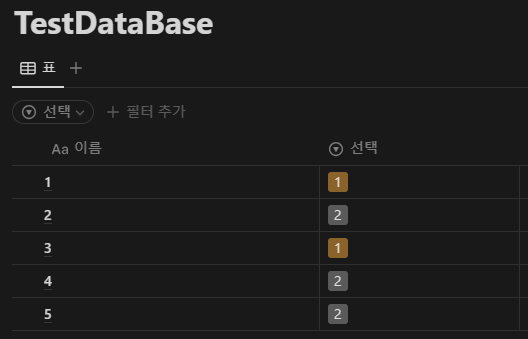
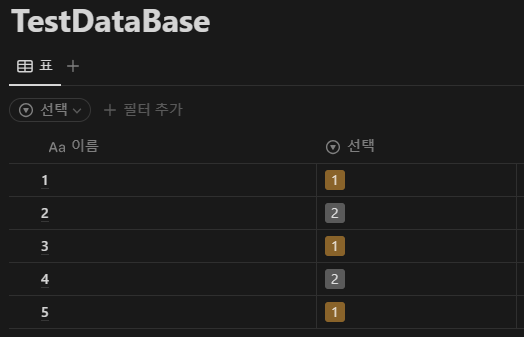

## 1. Introduction

<br>

- [Notion](https://www.notion.so)은 페이지, 데이터베이스 등에 대해 [REST](https://ko.wikipedia.org/wiki/REST) API를 지원한다.
	- API 접근을 하려면 Database 및 API 키가 필요하다.
		키를 얻는 방법에 대해서는 [Build your first integration](https://developers.notion.com/docs/create-a-notion-integration)을 참조한다.
	- Notion의 API Reference는 [NOTION API - Introduction](https://developers.notion.com/reference/intro)을 참조한다.
- 여기서는 `database`에 대한 `page` 작업을 다룬다.
	1. [Create a page](https://developers.notion.com/reference/post-page)
	2. [Retrieve a page](https://developers.notion.com/reference/retrieve-a-page)
	3. [Update page properties](https://developers.notion.com/reference/patch-page)
	4. [Archive a page](https://developers.notion.com/reference/archive-a-page)

<br>

## 2. Database to perform

<br>

- Page query 방법에 앞서, 테스트를 수행할 DB의 형태는 아래와 같다.
	
- DB 작업 수행 간 JSON 형식의 [Page object](https://developers.notion.com/reference/page)를 HTTP body에 실어 전송받게 된다.
- Reference 페이지를 참조하여 구현한 JSON object의 형태는 아래와 같다.
    <details>
    <summary>QueryPageItem (펼치기 / 접기)</summary>

    ```cs
    using System.Text.Json.Serialization;

    namespace NotionAPI.Objects;

    // https://developers.notion.com/reference/post-page 에 따라 작성
    public class QueryPageItem
    {
        [JsonIgnore(Condition = JsonIgnoreCondition.WhenWritingNull)]
        public Parent? parent { get; set; }

        [JsonIgnore(Condition = JsonIgnoreCondition.WhenWritingNull)]
        public Dictionary<string, PageProperty>? properties { get; set; }

        [JsonIgnore(Condition = JsonIgnoreCondition.WhenWritingNull)]
        public List<object>? children { get; set; }

        [JsonIgnore(Condition = JsonIgnoreCondition.WhenWritingNull)]
        public object? icon { get; set; }

        [JsonIgnore(Condition = JsonIgnoreCondition.WhenWritingNull)]
        public object? cover { get; set; }

        [JsonIgnore(Condition = JsonIgnoreCondition.WhenWritingNull)]
        public bool? archived { get; set; }
    }
    ```
    </details>
    <details>
    <summary>PageInformation (펼치기 / 접기)</summary>

    ```cs
    using System.Text.Json.Serialization;

    namespace NotionAPI.Objects;

    // https://developers.notion.com/reference/page 에 따라 작성
    public class PageInformation
    {
        [JsonIgnore(Condition = JsonIgnoreCondition.WhenWritingNull)]
        public string? @object { get; set; }

        [JsonIgnore(Condition = JsonIgnoreCondition.WhenWritingNull)]
        public string? id { get; set; }

        [JsonIgnore(Condition = JsonIgnoreCondition.WhenWritingDefault)]
        public DateTime created_time { get; set; }

        [JsonIgnore(Condition = JsonIgnoreCondition.WhenWritingNull)]
        public User? created_by { get; set; }

        [JsonIgnore(Condition = JsonIgnoreCondition.WhenWritingDefault)]
        public DateTime last_edited_time { get; set; }

        [JsonIgnore(Condition = JsonIgnoreCondition.WhenWritingNull)]
        public User? last_edited_by { get; set; }

        [JsonIgnore(Condition = JsonIgnoreCondition.WhenWritingDefault)]
        public bool archived { get; set; }

        [JsonIgnore(Condition = JsonIgnoreCondition.WhenWritingNull)]
        public object? icon { get; set; }

        [JsonIgnore(Condition = JsonIgnoreCondition.WhenWritingNull)]
        public object? cover { get; set; }

        [JsonIgnore(Condition = JsonIgnoreCondition.WhenWritingNull)]
        public Dictionary<string, PageProperty>? properties { get; set; }

        [JsonIgnore(Condition = JsonIgnoreCondition.WhenWritingNull)]
        public Parent? parent { get; set; }

        [JsonIgnore(Condition = JsonIgnoreCondition.WhenWritingNull)]
        public string? url { get; set; }

        [JsonIgnore(Condition = JsonIgnoreCondition.WhenWritingNull)]
        public string? public_url { get; set; }
    }
    ```
    </details>
	<details>
	<summary>PageProperty (펼치기 / 접기)</summary>

	```cs
	using System.Text.Json;
	using System.Text.Json.Serialization;

	namespace NotionAPI.Objects;

	// https://developers.notion.com/reference/page-property-values 에 따라 작성
	[JsonConverter(typeof(PagePropertyConverter))]
	public class PageProperty
	{
	    [JsonIgnore(Condition = JsonIgnoreCondition.WhenWritingNull)]
	    public string? id { get; set; }
	}

	public sealed class PageSelect : PageProperty
	{
	    public Select? select { get; set; }
	}

	public sealed class PageTitle : PageProperty
	{
	    public List<RichText>? title { get; set; }
	}

	public class PagePropertyConverter : JsonConverter<PageProperty>
	{
	    public override PageProperty? Read(ref Utf8JsonReader reader, Type typeToConvert, JsonSerializerOptions options)
	    {
	        var jsonDoc = JsonDocument.ParseValue(ref reader);
	        if (jsonDoc.RootElement.TryGetProperty("type", out var typeName))
	        {
	            return typeName.GetString() switch
	            {
	                "select" => JsonSerializer.Deserialize<PageSelect>(jsonDoc),
	                "title" => JsonSerializer.Deserialize<PageTitle>(jsonDoc),
	                _ => null
	            };
	        }

	        return null;
	    }

	    public override void Write(Utf8JsonWriter writer, PageProperty value, JsonSerializerOptions options)
	    {
	        switch (value)
	        {
	            case PageSelect select:
	                JsonSerializer.Serialize(writer, select);
	                break;

	            case PageTitle title:
	                JsonSerializer.Serialize(writer, title);
	                break;
	        }
	    }
	}
	```
	</details>
	<details>
	<summary>User (펼치기 / 접기)</summary>

	```cs
	using System.Text.Json.Serialization;

	namespace NotionAPI.Objects;

	// https://developers.notion.com/reference/user 에 따라 작성
	[JsonPolymorphic(TypeDiscriminatorPropertyName = "type")]
	[JsonDerivedType(typeof(People), typeDiscriminator: "person")]
	[JsonDerivedType(typeof(Bots), typeDiscriminator: "bot")]
	public class User
	{
	    public string? @object { get; set; }
	    public string? id { get; set; }
	    public string? name { get; set; }
	    public string? avatar_url { get; set; }
	}

	public sealed class People : User
	{
	    public object? person { get; set; }
	}

	public sealed class Bots : User
	{
	    public object? bot { get; set; }
	}
	```
	</details>
	<details>
	<summary>Parent (펼치기 / 접기)</summary>

	```cs
	using System.Text.Json.Serialization;

	namespace NotionAPI.Objects;

	// https://developers.notion.com/reference/parent-object 에 따라 작성
	[JsonPolymorphic(TypeDiscriminatorPropertyName = "type")]
	[JsonDerivedType(typeof(DatabaseParent), typeDiscriminator: "database_id")]
	[JsonDerivedType(typeof(PageParent), typeDiscriminator: "page_id")]
	[JsonDerivedType(typeof(WorkspaceParent), typeDiscriminator: "workspace")]
	[JsonDerivedType(typeof(BlockParent), typeDiscriminator: "block_id")]
	public class Parent
	{
	}

	public sealed class DatabaseParent : Parent
	{
	    public string? database_id { get; set; }
	}

	public sealed class PageParent : Parent
	{
	    public string? page_id { get; set; }
	}

	public sealed class WorkspaceParent : Parent
	{
	    public bool workspace { get; set; } = true;
	}

	public sealed class BlockParent : Parent
	{
	    public string? block_id { get; set; }
	}
	```
	</details>
	<details>
	<summary>RichText (펼치기 / 접기)</summary>

	```cs
	using System.Text.Json.Serialization;

	namespace NotionAPI.Objects;

	// https://developers.notion.com/reference/rich-text 에 따라 작성
	[JsonPolymorphic(TypeDiscriminatorPropertyName = "type")]
	[JsonDerivedType(typeof(RichTextWithText), typeDiscriminator: "text")]
	[JsonDerivedType(typeof(RichTextWithMention), typeDiscriminator: "mention")]
	[JsonDerivedType(typeof(RichTextWithEquation), typeDiscriminator: "equation")]
	public class RichText
	{
	    [JsonIgnore(Condition = JsonIgnoreCondition.WhenWritingNull)]
	    public Annotations? annotations { get; set; }

	    [JsonIgnore(Condition = JsonIgnoreCondition.WhenWritingNull)]
	    public string? plain_text { get; set; }

	    [JsonIgnore(Condition = JsonIgnoreCondition.WhenWritingNull)]
	    public string? href { get; set; }
	}

	public sealed class RichTextWithText : RichText
	{
	    public Text? text { get; set; }
	}

	public sealed class RichTextWithMention : RichText
	{
	    public object? mention { get; set; }
	}

	public sealed class RichTextWithEquation : RichText
	{
	    public object? equation { get; set; }
	}

	public class Annotations
	{
	    public bool bold { get; set; }
	    public bool italic { get; set; }
	    public bool strikethrough { get; set; }
	    public bool underline { get; set; }
	    public bool code { get; set; }
	    public string? color { get; set; } = "default";
	}

	public class Text
	{
	    public string? content { get; set; }

	    [JsonIgnore(Condition = JsonIgnoreCondition.WhenWritingNull)]
	    public Link? link { get; set; }
	}

	public class Link
	{
	    public string? url { get; set; }
	}
	```
	</details>
	<details>
	<summary>Select (펼치기 / 접기)</summary>

	```cs
	using System.Text.Json.Serialization;

	namespace NotionAPI.Objects;

	// https://developers.notion.com/reference/property-object#select 에 따라 작성
	public class Select
	{
	    [JsonIgnore(Condition = JsonIgnoreCondition.WhenWritingNull)]
	    public string? id { get; set; }

	    public string? name { get; set; }

	    [JsonIgnore(Condition = JsonIgnoreCondition.WhenWritingNull)]
	    public string? color { get; set; }
	}
	```
	</details>

<br>

## 3. Create a page

<br>

- DB에 새 페이지를 추가하는 방법은 아래와 같다.
    ```cs
    using NotionAPI.Objects;
    using System.Net.Http.Json;
    using System.Text.Json;

    private static void Main(string[] args)
    {
        string baseUri = $"https://api.notion.com/v1/pages";
        string databaseKey = "데이터베이스 키";
        string APIKey = "API 키";

        Create(baseUri, databaseKey, APIKey);
    }
    ```
    ```cs
    private static bool Create(string baseUri, string databaseKey, string APIKey)
    {
        HttpClient client = new();

        // https://developers.notion.com/reference/post-page 문서 내용에 따라 Post로 request 작성
        var request = new HttpRequestMessage(HttpMethod.Post, $"{baseUri}");
        request.Headers.Add("Authorization", $"Bearer {APIKey}");
        request.Headers.Add("Notion-Version", "2022-06-28");

        var queryItem = new QueryPageItem();
        queryItem.parent = new DatabaseParent() { database_id = databaseKey };

        var properties = new Dictionary<string, PageProperty>
        {
            { "이름", new PageTitle() { title = [new RichTextWithText() { text = new() { content = "5" } }] } },
            { "선택", new PageSelect() { select = new() { name = "2" } } }
        };

        queryItem.properties = properties;
        request.Content = JsonContent.Create(queryItem);

        var response = client.Send(request);

        // StatusCode를 포함한 Header 출력
        Console.WriteLine(response);
        // JSON 형식의 Body 출력
        var content = new StreamReader(response.Content.ReadAsStream()).ReadToEnd();
        Console.WriteLine(content);

        // Parsing
        var parsed = JsonSerializer.Deserialize<PageInformation>(content);
        Console.WriteLine($"Page key : {parsed?.id}");

        return response.StatusCode == System.Net.HttpStatusCode.OK;
    }
    ```
- 정상적으로 페이지가 추가된 경우 아래 이미지와 같이 UI에 표시된다.
    
- 수신되는 데이터는 아래와 같다.
	<details>
	<summary>Header (펼치기 / 접기)</summary>

	```text
	StatusCode: 200, ReasonPhrase: 'OK', Version: 1.1, Content: System.Net.Http.HttpConnectionResponseContent, Headers:
    {
        Date: Thu, 11 Apr 2024 23:03:08 GMT
        Connection: keep-alive
        X-Powered-By: Express
        x-notion-request-id: 79425409-d6c4-4f7e-af46-c4fcf9b1d7fd
        ETag: W/"3a1-FH+l03dxu3kIA70Ha6M4x4zVZ1Q"
        Vary: Accept-Encoding
        CF-Cache-Status: DYNAMIC
        Set-Cookie: __cf_bm=db7NUVgzSpxFIGnabQKSx8uKGVWP4sdzbSIrAgEpUMc-1712876588-1.0.1.1-ncsWrdfTHvjv7PNpeP4jU9BKfgwbbxk4PwOKWWn8er1QkthqzlKeEJMr_PVJET.H2d49DLFKaDG680qkRsS1jg; path=/; expires=Thu, 11-Apr-24 23:33:08 GMT; domain=.notion.com; HttpOnly; Secure
        Server: cloudflare
        CF-RAY: 872e9bb22f71329c-ICN
        Content-Type: application/json; charset=utf-8
        Content-Length: 929
    }
	```
	</details>
	<details>
	<summary>Body (펼치기 / 접기)</summary>

	```json
	{
      "object": "page",
      "id": "Page id",
      "created_time": "2024-04-11T23:03:00.000Z",
      "last_edited_time": "2024-04-11T23:03:00.000Z",
      "created_by": {
        "object": "user",
        "id": "유저 id"
      },
      "last_edited_by": {
        "object": "user",
        "id": "유저 id"
      },
      "cover": null,
      "icon": null,
      "parent": {
        "type": "database_id",
        "database_id": "DB id"
      },
      "archived": false,
      "in_trash": false,
      "properties": {
        "선택": {
          "id": "sKnP",
          "type": "select",
          "select": {
            "id": "CsLi",
            "name": "2",
            "color": "gray"
          }
        },
        "이름": {
          "id": "title",
          "type": "title",
          "title": [
            {
              "type": "text",
              "text": {
                "content": "5",
                "link": null
              },
              "annotations": {
                "bold": false,
                "italic": false,
                "strikethrough": false,
                "underline": false,
                "code": false,
                "color": "default"
              },
              "plain_text": "5",
              "href": null
            }
          ]
        }
      },
      "url": "https://www.notion.so/5-Page id",
      "public_url": null,
      "request_id": "79425409-d6c4-4f7e-af46-c4fcf9b1d7fd"
    }
	```
	</details>

<br>

## 4. Retrieve a page

<br>

- Page의 id를 알고 있다면 해당 page의 정보를 얻어올 수 있다.
    ```cs
    using NotionAPI.Objects;
    using System.Text.Json;

    private static void Main(string[] args)
    {
        string baseUri = $"https://api.notion.com/v1/pages";
        string pageKey = "Page 키";
        string APIKey = "API 키";

        Console.WriteLine(Retrieve(baseUri, pageKey, APIKey));
    }
    ```
    ```cs
    private static bool Retrieve(string baseUri, string pageKey, string APIKey)
    {
        HttpClient client = new();

        // https://developers.notion.com/reference/retrieve-a-page 문서 내용에 따라 Get으로 request 작성
        var request = new HttpRequestMessage(HttpMethod.Get, $"{baseUri}/{pageKey}");
        request.Headers.Add("Authorization", $"Bearer {APIKey}");
        request.Headers.Add("Notion-Version", "2022-06-28");

        var response = client.Send(request);

        // StatusCode를 포함한 Header 출력
        Console.WriteLine(response);
        // JSON 형식의 Body 출력
        var content = new StreamReader(response.Content.ReadAsStream()).ReadToEnd();
        Console.WriteLine(content);

        var parsed = JsonSerializer.Deserialize<PageInformation>(content);

        return response.StatusCode == System.Net.HttpStatusCode.OK;
    }
    ```
- 수신되는 데이터는 아래와 같다.
	<details>
	<summary>Header (펼치기 / 접기)</summary>

	```text
	StatusCode: 200, ReasonPhrase: 'OK', Version: 1.1, Content: System.Net.Http.HttpConnectionResponseContent, Headers:
    {
        Date: Thu, 11 Apr 2024 23:09:09 GMT
        Connection: keep-alive
        X-Powered-By: Express
        x-notion-request-id: b3ca9a32-2a2d-4e98-9198-a97d71c82434
        ETag: W/"3a1-VH41nGESWpRWFLu2jXoGdY84fSU"
        Vary: Accept-Encoding
        CF-Cache-Status: DYNAMIC
        Set-Cookie: __cf_bm=JEsgOya342GIBSYbtCzwFBr7m.gOIiJF4w5rrrvnNnI-1712876949-1.0.1.1-aJ2d3dMM99HohpAwBh1A99GRK61AnfsFJ1nCeYw66lEEGqXVROXceGAWwl3GqZaseV0ghn0wSd.iQ8QputNZyg; path=/; expires=Thu, 11-Apr-24 23:39:09 GMT; domain=.notion.com; HttpOnly; Secure
        Server: cloudflare
        CF-RAY: 872ea4833956c071-ICN
        Content-Type: application/json; charset=utf-8
        Content-Length: 929
    }
	```
	</details>
	<details>
	<summary>Body (펼치기 / 접기)</summary>

	```json
	{
      "object": "page",
      "id": "Page id",
      "created_time": "2024-04-11T23:03:00.000Z",
      "last_edited_time": "2024-04-11T23:03:00.000Z",
      "created_by": {
        "object": "user",
        "id": "유저 id"
      },
      "last_edited_by": {
        "object": "user",
        "id": "유저 id"
      },
      "cover": null,
      "icon": null,
      "parent": {
        "type": "database_id",
        "database_id": "DB id"
      },
      "archived": false,
      "in_trash": false,
      "properties": {
        "선택": {
          "id": "sKnP",
          "type": "select",
          "select": {
            "id": "CsLi",
            "name": "2",
            "color": "gray"
          }
        },
        "이름": {
          "id": "title",
          "type": "title",
          "title": [
            {
              "type": "text",
              "text": {
                "content": "5",
                "link": null
              },
              "annotations": {
                "bold": false,
                "italic": false,
                "strikethrough": false,
                "underline": false,
                "code": false,
                "color": "default"
              },
              "plain_text": "5",
              "href": null
            }
          ]
        }
      },
      "url": "https://www.notion.so/5-Page id",
      "public_url": null,
      "request_id": "b3ca9a32-2a2d-4e98-9198-a97d71c82434"
    }
	```
	</details>

<br>

## 5. Update page properties

<br>

- `PATCH` request를 통해 page의 속성을 변경할 수 있다.
- 이 때 변경할 속성을 body에 실어 보낸다.
    ```cs
    using NotionAPI.Objects;
    using System.Net.Http.Json;
    using System.Text.Json;

    private static void Main(string[] args)
    {
        string baseUri = $"https://api.notion.com/v1/pages";
        string pageKey = "Page 키";
        string APIKey = "API 키";

        Update(baseUri, pageKey, APIKey);
    }
    ```
    ```cs
    private static bool Update(string baseUri, string pageKey, string APIKey)
    {
        HttpClient client = new();

        // https://developers.notion.com/reference/patch-page 문서 내용에 따라 Patch로 request 작성
        var request = new HttpRequestMessage(HttpMethod.Patch, $"{baseUri}/{pageKey}");
        request.Headers.Add("Authorization", $"Bearer {APIKey}");
        request.Headers.Add("Notion-Version", "2022-06-28");

        var queryItem = new QueryPageItem();

        var properties = new Dictionary<string, PageProperty>()
        {
            { "선택" , new PageSelect() { select = new() { name = "1" } } }
        };

        queryItem.properties = properties;
        request.Content = JsonContent.Create(queryItem);

        var response = client.Send(request);

        // StatusCode를 포함한 Header 출력
        Console.WriteLine(response);
        // JSON 형식의 Body 출력
        var content = new StreamReader(response.Content.ReadAsStream()).ReadToEnd();
        Console.WriteLine(content);

        var parsed = JsonSerializer.Deserialize<PageInformation>(content);

        return response.StatusCode == System.Net.HttpStatusCode.OK;
    }
    ```
- 정상적으로 업데이트가 수행되면 아래 이미지와 같이 UI에 표시된다.
    
- 수신되는 데이터는 아래와 같다.
	<details>
	<summary>Header (펼치기 / 접기)</summary>

	```text
	StatusCode: 200, ReasonPhrase: 'OK', Version: 1.1, Content: System.Net.Http.HttpConnectionResponseContent, Headers:
    {
        Date: Thu, 11 Apr 2024 23:25:12 GMT
        Connection: keep-alive
        X-Powered-By: Express
        x-notion-request-id: e9860a05-57ad-4af3-840a-9131d1a63a14
        ETag: W/"3a3-1n/Ro8ikDAsBoSwv2px7Hn0qHOM"
        Vary: Accept-Encoding
        CF-Cache-Status: DYNAMIC
        Set-Cookie: __cf_bm=CPbn0HafswMCKjwPy0KcFkRS9acC84..kK1qKaFfMDA-1712877912-1.0.1.1-nts9GcwFNiFeWgx6.__DrUgd2QsvGXSsA4r2oivFQd5GZcHQcCWcj.8loYqKvG.JL3xxdUUXpuV4FKbWfgac4w; path=/; expires=Thu, 11-Apr-24 23:55:12 GMT; domain=.notion.com; HttpOnly; Secure
        Server: cloudflare
        CF-RAY: 872ebc081c9bc17d-ICN
        Content-Type: application/json; charset=utf-8
        Content-Length: 931
    }
	```
	</details>
	<details>
	<summary>Body (펼치기 / 접기)</summary>

	```json
    {
      "object": "page",
      "id": "Page id",
      "created_time": "2024-04-11T23:03:00.000Z",
      "last_edited_time": "2024-04-11T23:25:00.000Z",
      "created_by": {
        "object": "user",
        "id": "유저 id"
      },
      "last_edited_by": {
        "object": "user",
        "id": "유저 id"
      },
      "cover": null,
      "icon": null,
      "parent": {
        "type": "database_id",
        "database_id": "DB id"
      },
      "archived": false,
      "in_trash": false,
      "properties": {
        "선택": {
          "id": "sKnP",
          "type": "select",
          "select": {
            "id": "@:oT",
            "name": "1",
            "color": "yellow"
          }
        },
        "이름": {
          "id": "title",
          "type": "title",
          "title": [
            {
              "type": "text",
              "text": {
                "content": "5",
                "link": null
              },
              "annotations": {
                "bold": false,
                "italic": false,
                "strikethrough": false,
                "underline": false,
                "code": false,
                "color": "default"
              },
              "plain_text": "5",
              "href": null
            }
          ]
        }
      },
      "url": "https://www.notion.so/5-Page id",
      "public_url": null,
      "request_id": "e9860a05-57ad-4af3-840a-9131d1a63a14"
    }
	```
	</details>

<br>

## 6. Archive a page

<br>

- Notion API는 page의 영구 삭제를 지원하지 않는다.
- 대신 보관 기능을 지원하며 UI에서 숨김 처리가 된다.
- Body의 `archived` 속성을 `true`로 설정하면 보관, `false`로 설정하면 해제가 된다.
    아래는 `true`로 설정하여 보관하는 예시를 보여준다.
    ```cs
    using NotionAPI.Objects;
    using System.Net.Http.Json;

    private static void Main(string[] args)
    {
        string baseUri = $"https://api.notion.com/v1/pages";
        string pageKey = "Page 키";
        string APIKey = "API 키";

        Archieve(baseUri, pageKey, APIKey);
    }
    ```
    ```cs
    private static bool Archieve(string baseUri, string pageKey, string APIKey)
    {
        HttpClient client = new();

        // https://developers.notion.com/reference/archive-a-page 문서 내용에 따라 Patch로 request 작성
        var request = new HttpRequestMessage(HttpMethod.Patch, $"{baseUri}/{pageKey}");
        request.Headers.Add("Authorization", $"Bearer {APIKey}");
        request.Headers.Add("Notion-Version", "2022-06-28");

        var queryItem = new QueryPageItem();
        queryItem.archived = true;
        request.Content = JsonContent.Create(queryItem);

        var response = client.Send(request);

        // StatusCode를 포함한 Header 출력
        Console.WriteLine(response);
        // JSON 형식의 Body 출력
        Console.WriteLine(new StreamReader(response.Content.ReadAsStream()).ReadToEnd());

        return response.StatusCode == System.Net.HttpStatusCode.OK;
    }
    ```
- 정상적으로 기능이 수행되었다면 UI에서 항목이 사라진다.
    
- 수신되는 데이터는 아래와 같다.
	<details>
	<summary>Header (펼치기 / 접기)</summary>

	```text
	StatusCode: 200, ReasonPhrase: 'OK', Version: 1.1, Content: System.Net.Http.HttpConnectionResponseContent, Headers:
    {
        Date: Thu, 11 Apr 2024 23:33:54 GMT
        Connection: keep-alive
        X-Powered-By: Express
        x-notion-request-id: 121f6b11-1c42-4f4f-9171-1eea30a2c5ac
        ETag: W/"3a1-TL1xmU1SdWnUsVY+g5AIC/QdNmU"
        Vary: Accept-Encoding
        CF-Cache-Status: DYNAMIC
        Set-Cookie: __cf_bm=_lT094_241halWvRUhfWo9HJyKUIzPo9HezNiGr1kfo-1712878434-1.0.1.1-qgv6Tzj9Whr9x7dXz7M53J3dkIU3VDiSMeHwfTScycdRndYTxuG0Bq9Q.gqxNVpqA1Yf_puzTUvDf6rzSNqn8w; path=/; expires=Fri, 12-Apr-24 00:03:54 GMT; domain=.notion.com; HttpOnly; Secure
        Server: cloudflare
        CF-RAY: 872ec8c8d89ac067-ICN
        Content-Type: application/json; charset=utf-8
        Content-Length: 929
    }
	```
	</details>
	<details>
	<summary>Body (펼치기 / 접기)</summary>

	```json
    {
      "object": "page",
      "id": "Page id",
      "created_time": "2024-04-11T23:03:00.000Z",
      "last_edited_time": "2024-04-11T23:33:00.000Z",
      "created_by": {
        "object": "user",
        "id": "유저 id"
      },
      "last_edited_by": {
        "object": "user",
        "id": "유저 id"
      },
      "cover": null,
      "icon": null,
      "parent": {
        "type": "database_id",
        "database_id": "DB id"
      },
      "archived": true,
      "in_trash": true,
      "properties": {
        "선택": {
          "id": "sKnP",
          "type": "select",
          "select": {
            "id": "@:oT",
            "name": "1",
            "color": "yellow"
          }
        },
        "이름": {
          "id": "title",
          "type": "title",
          "title": [
            {
              "type": "text",
              "text": {
                "content": "5",
                "link": null
              },
              "annotations": {
                "bold": false,
                "italic": false,
                "strikethrough": false,
                "underline": false,
                "code": false,
                "color": "default"
              },
              "plain_text": "5",
              "href": null
            }
          ]
        }
      },
      "url": "https://www.notion.so/5-Page id",
      "public_url": null,
      "request_id": "121f6b11-1c42-4f4f-9171-1eea30a2c5ac"
    }
	```
	</details>

<br>

## 7. 참조 자료

<br>

- [NOTION API - Introduction](https://developers.notion.com/reference/intro)
- [Build your first integration](https://developers.notion.com/docs/create-a-notion-integration)
- [Create a page](https://developers.notion.com/reference/post-page)
- [Retrieve a page](https://developers.notion.com/reference/retrieve-a-page)
- [Update page properties](https://developers.notion.com/reference/patch-page)
- [Archive a page](https://developers.notion.com/reference/archive-a-page)
- [System.Text.Json을 사용하여 파생 클래스의 속성을 직렬화하는 방법](https://learn.microsoft.com/ko-kr/dotnet/standard/serialization/system-text-json/polymorphism?pivots=dotnet-8-0)
- [System.Text.Json을 사용하여 속성을 무시하는 방법](https://learn.microsoft.com/ko-kr/dotnet/standard/serialization/system-text-json/ignore-properties)
- [.NET에서 JSON serialization(마샬링)용 사용자 지정 변환기를 작성하는 방법](https://learn.microsoft.com/ko-kr/dotnet/standard/serialization/system-text-json/converters-how-to?pivots=dotnet-8-0)