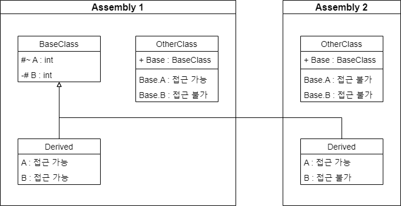

## 1. Introduction

 

- [Access Modifiers](https://learn.microsoft.com/ko-kr/dotnet/csharp/language-reference/keywords/access-modifiers) (액세스 한정자) 는 형식 또는 멤버의 접근성을 지정할 때 사용한다.
- C#에 있는 한정자는 총 5가지로 이를 조합하여 7가지의 접근성 수준을 지정할 수 있다.

 

## 2. 액세스 한정자

 

- C#에 있는 액세스 한정자는 아래와 같다.

 

|항목|비고|
|---|---|
|[public](https://learn.microsoft.com/ko-kr/dotnet/csharp/language-reference/keywords/public)||
|[protected](https://learn.microsoft.com/ko-kr/dotnet/csharp/language-reference/keywords/protected)||
|[internal](https://learn.microsoft.com/ko-kr/dotnet/csharp/language-reference/keywords/internal)||
|[private](https://learn.microsoft.com/ko-kr/dotnet/csharp/language-reference/keywords/private)||
|[file](https://learn.microsoft.com/ko-kr/dotnet/csharp/language-reference/keywords/file)|C# 11 (.NET 7)|

 

- 이를 이용하여 지정할 수 있는 접근성 수준은 아래와 같다.

 

|항목|접근성 범위|비고|
|---|---|---|
|[public](https://learn.microsoft.com/ko-kr/dotnet/csharp/language-reference/keywords/public)|제한 없음||
|[protected](https://learn.microsoft.com/ko-kr/dotnet/csharp/language-reference/keywords/protected)|파생된 형식||
|[internal](https://learn.microsoft.com/ko-kr/dotnet/csharp/language-reference/keywords/internal)|선언 어셈블리||
|[private](https://learn.microsoft.com/ko-kr/dotnet/csharp/language-reference/keywords/private)|선언 형식||
|[file](https://learn.microsoft.com/ko-kr/dotnet/csharp/language-reference/keywords/file)|코드 파일 단위|C# 11 (.NET 7)|
|[protected internal](https://learn.microsoft.com/ko-kr/dotnet/csharp/language-reference/keywords/protected-internal)|선언 어셈블리 또는 파생된 형식||
|[private protected](https://learn.microsoft.com/ko-kr/dotnet/csharp/language-reference/keywords/private-protected)|선언 어셈블리 안의 파생된 형식|C# 7.2|

- 상기 표의 2 항목 (`protected internal`, `private protected`) 의 경우 의미가 모호하게 보일 수 있다.
- 특히 `private protected`가 그럴 수 있는데, 이는 `private` 단어 때문이다.

 

### 2.1. protected internal, private protected

 

 

- 모호한 두 요소 (`protected internal`, `private protected`) 에 대한 설명을 위해 다이어그램을 하나 그렸다.
- `public`은 `+`, `protected internal`은 `#~`, `private protected`는 `-#`로 표시하였으며 접근 가능 여부를 함께 넣었다.

 

- 결론적으로 보면, 접근성 범위를 아래와 같이 정리할 수 있다.
    - `protected internal` : Internal + protected
    - `private protected` : Protected를 internal로 제한
- 따라서 `private protected`에서 `private`이란 단어는 `Assembly 내부` 정도로 해석할 수 있다.
    - `internal protected`가 맞는 단어 접근인 것 같은데, `protected internal`이 `internal protected`와 혼용되고 있어 용어를 따로 설정한 것 같다.

 

- 자세한 내용은 [protected internal](7.%20Protected%20internal.md), [private protected](8.%20Private%20protected.md)에서 다루도록 한다.

 

## 3. 참조 자료

 

- [액세스 한정자(C# 참조)](https://learn.microsoft.com/ko-kr/dotnet/csharp/language-reference/keywords/access-modifiers)
- [액세스 가능성 수준(C# 참조)](https://learn.microsoft.com/ko-kr/dotnet/csharp/language-reference/keywords/accessibility-levels)
- [protected internal](7.%20Protected%20internal.md)
- [private protected](8.%20Private%20protected.md)