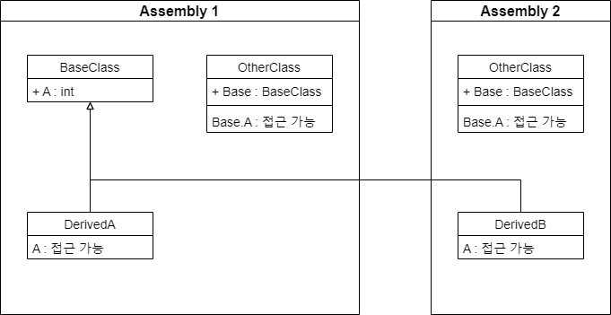

## Introduction

<br>

- `public` 한정자는 범위에 제한이 없는 액세스 한정자이다.
- 모든 액세스 시도가 성공하기 때문에 외부 노출이 필요 없는 멤버에 대해서는 *`public`을 사용하지 않는 것*이 좋다.

<br>

## Example

<br>


```cs
// Assembly 1

namespace Assembly1
{
    public class BaseClass
    {
        public string A = "public";
    }

    internal class DerivedA : BaseClass
    {
        public DerivedA()
        {
            A = "DerivedA";              // OK
        }
    }

    internal class OtherClass
    {
        public BaseClass Base = new BaseClass();

        public OtherClass()
        {
            Base.A = "OtherClass";         // OK
        }
    }
}
```
```cs
namespace Assembly2
{
    internal class DerivedB : BaseClass
    {
        public DerivedB()
        {
            A = "DerivedB";              // OK
        }
    }

    internal class OtherClass
    {
        public BaseClass Base = new BaseClass();

        public OtherClass()
        {
            Base.A = "OtherClass";      // OK
        }
    }
}
```

<br>

## 참조 자료

<br>

- [public(C# 참조)](https://learn.microsoft.com/ko-kr/dotnet/csharp/language-reference/keywords/public)