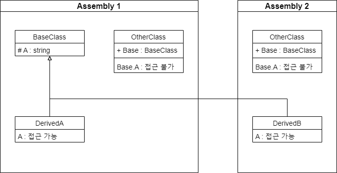

## Introduction

<br>

- `protected` 한정자는 멤버 액세스 한정자이다.
- `protected`의 범위는 선언 및 파생 클래스 내부로, 클래스 외부에서는 접근이 불가하다.

<br>

## Example

<br>


```cs
// Assembly 1

namespace Assembly1
{
    public class BaseClass
    {
        protected string A = "protected";
    }

    internal class DerivedA : BaseClass
    {
        public DerivedA()
        {
            A = "DerivedA";              // OK
        }
    }

    internal class OtherClass
    {
        public BaseClass Base = new BaseClass();

        public OtherClass()
        {
            Base.A = "OtherClass";         // CS0122
        }
    }
}
```
```cs
// Assembly 2

namespace Assembly2
{
    internal class DerivedB : BaseClass
    {
        public DerivedB()
        {
            A = "DerivedB";              // OK
        }
    }

    internal class OtherClass
    {
        public BaseClass Base = new BaseClass();

        public OtherClass()
        {
            Base.A = "OtherClass";      // CS0122
        }
    }
}
```

<br>

## 참조 자료

<br>

- [protected(C# 참조)](https://learn.microsoft.com/ko-kr/dotnet/csharp/language-reference/keywords/protected)