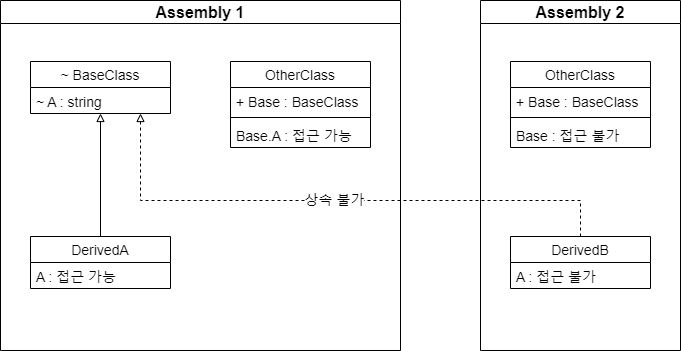
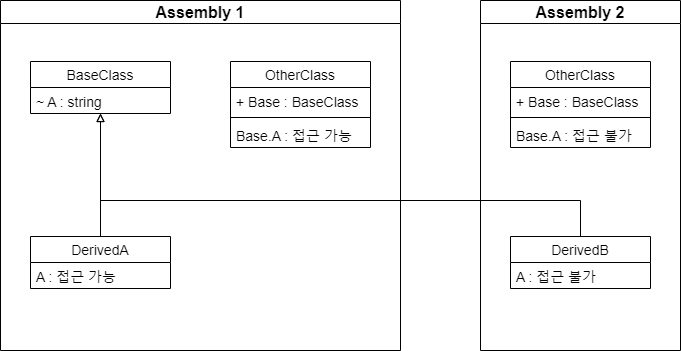

## Introduction

<br>

- `internal` 키워드는 `형식 및 멤버에 대한 액세스 한정자`이다.
- `internal`로 선언하면 해당 어셈블리 내에서 `public`같이 접근이 가능하게 된다.
- 주로 모듈 단위 프로젝트에서 내부 구성요소에 사용한다.

<br>

## Example

<br>

### Type

<br>


```cs
// Assembly 1

namespace Assembly1
{
    internal class BaseClass
    {
        internal string A = "internal";
    }

    internal class DerivedA : BaseClass
    {
        public DerivedA()
        {
            A = "DerivedA";                // OK
        }
    }

    internal class OtherClass
    {
        public BaseClass Base = new BaseClass();

        private static void Main(string[] args)
        {
            Base.A = "OtherClass";         // OK
        }
    }
}
```
```cs
namespace Assembly2
{
    internal class DerivedB : BaseClass     // CS0122 : 상속 불가
    {
    }

    internal class OtherClass
    {
        public BaseClass Base = new BaseClass();       // CS0122
    }
}
```

<br>

### Member

<br>


```cs
// Assembly 1

namespace Assembly1
{
    public class BaseClass
    {
        internal string A = "internal";
    }

    internal class DerivedA : BaseClass
    {
        public DerivedA()
        {
            A = "DerivedA";              // OK
        }
    }

    internal class OtherClass
    {
        public BaseClass Base = new BaseClass();

        public OtherClass()
        {
            Base.A = "OtherClass";       // OK
        }
    }
}
```
```cs
// Assembly 2

namespace Assembly2
{
    internal class DerivedB : BaseClass
    {
        public DerivedB()
        {
            A = "DerivedB";              // CS0122
        }
    }

    internal class OtherClass
    {
        public BaseClass Base = new BaseClass();

        public OtherClass()
        {
            Base.A = "OtherClass";      // CS0122
        }
    }
}
```

<br>

## 참조 자료

<br>

- [internal(C# 참조)](https://learn.microsoft.com/ko-kr/dotnet/csharp/language-reference/keywords/internal)