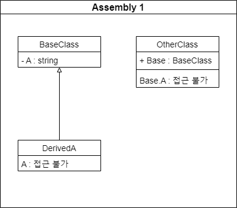

## Introduction

<br>

- `private` 키워드는 멤버 액세스 한정자이다.
- 가장 낮은 액세스 수준으로, 선언 형식 내에서만 사용할 수 있다.

<br>

## Example

<br>


```cs
namespace Assembly1
{
    public class BaseClass
    {
        private string A = "private";
    }

    internal class DerivedA : BaseClass
    {
        public DerivedA()
        {
            A = "DerivedA";                // CS0122
        }
    }

    internal class OtherClass
    {
        public BaseClass Base = new BaseClass();

        public OtherClass()
        {
            Base.A = "OtherClass";         // CS0122
        }
    }
}
```

<br>

### Backing field of property

<br>

- `private` 필드는 [property](https://learn.microsoft.com/ko-kr/dotnet/csharp/programming-guide/classes-and-structs/properties)의 `backing field`로 자주 쓰인다.

```cs
private double Meters;

public double KiloMeters
{
    get => Meters / 1000;
    set => Meters = value * 1000;
}
```

<br>

## 참조 자료

<br>

- [private(C# 참조)](https://learn.microsoft.com/ko-kr/dotnet/csharp/language-reference/keywords/private)