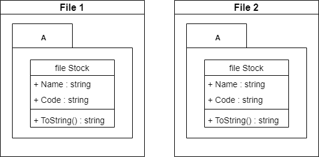

## Introduction

<br>

- `file` 한정자는 C# 11 (.NET 7) 에 도입된 `형식 한정자`다.
- 이 한정자는 형식의 범위를 해당 파일로 지정한다.
- 다른 코드 파일에서 이름이 겹치는 객체가 있는 경우 편리하게 사용할 수 있다.

<br>

## Example

<br>


```cs
// File 1

namespace A
{
    file class Stock
    {
        public string Name { get; init; }
        public string Code { get; init; }

        public override string ToString() => $"{Name}-{Code}";
    }
}
```
```cs
// File 2

namespace A
{
    file class Stock
    {
        public string Name { get; init; }
        public string Code { get; init; }

        public override string ToString() => $"{Code}-{Name}";
    }
}
```
```cs
// Program.cs - 사용 불가

namespace A
{
    internal class Program
    {
        private static void Main(string[] args)
        {
            Stock stock = new Stock();  // CS0246: 'Stock' 형식 또는 네임스페이스 이름을 찾을 수 없습니다. using 지시문 또는 어셈블리 참조가 있는지 확인하세요.
        }
    }
}
```

- 위의 예제와 같이 구현이 가능한데, 모듈화에 유용하게 쓰일 것으로 보인다.
- 같은 이름을 가진 거의 동일한 클래스지만, 컴파일 시 다른 클래스로 분리된다.

<br>

## 참조 자료

- [파일(C# 참조)](https://learn.microsoft.com/ko-kr/dotnet/csharp/language-reference/keywords/file)