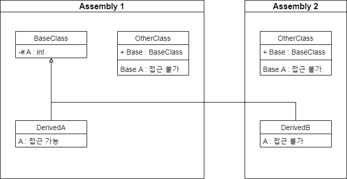

## 1. Introduction

<br>

- `private protected`는 `멤버 액세스 한정자`이다.
- `선언 어셈블리 안의 파생된 형식`까지 액세스 가능하며, 이외 영역에서는 접근이 불가능하다.

<br>

## 2. Information

<br>

### 2.1. private

<br>

- [private](5.%20Private.md)의 범위는 가장 낮은 액세스 수준으로, 선언 형식 내에서만 사용할 수 있다.
- 이를 다이어그램 및 코드로 나타내면 아래와 같다.
    
    ```cs
    namespace Assembly1
    {
        public class BaseClass
        {
            private string A = "private";
        }

        internal class DerivedA : BaseClass
        {
            public DerivedA()
            {
                A = "DerivedA";              // CS0122
            }
        }

        internal class OtherClass
        {
            public BaseClass Base = new BaseClass();

            public OtherClass()
            {
                Base.A = "OtherClass";       // CS0122
            }
        }
    }
    ```

<br>

### 2.2. protected

<br>

- [protected](3.%20Protected.md)의 범위는 선언 및 파생 클래스 내부로, 클래스 외부에서는 접근이 불가하다.
- 이를 다이어그램 및 코드로 나타내면 아래와 같다.
    
    ```cs
    // Assembly 1

    namespace Assembly1
    {
        public class BaseClass
        {
            protected string A = "protected";
        }

        internal class DerivedA : BaseClass
        {
            public DerivedA()
            {
                A = "DerivedA";                // OK
            }
        }

        internal class OtherClass
        {
            public BaseClass Base = new BaseClass();

            public OtherClass()
            {
                Base.A = "OtherClass";         // CS0122
            }
        }
    }
    ```
    ```cs
    // Assembly 2

    namespace Assembly2
    {
        internal class DerivedB : BaseClass
        {
            public DerivedB()
            {
                A = "DerivedB";              // OK
            }
        }

        internal class OtherClass
        {
            public BaseClass Base = new BaseClass();

            public OtherClass()
            {
                Base.A = "OtherClass";      // CS0122
            }
        }
    }
    ```

<br>

### 2.3. Internal

<br>

- 한편, `private protected`에서 `private`은 사실 [internal](4.%20Internal.md)에 가까운 의미이다.
- `internal` 키워드는 `형식 및 멤버에 대한 액세스 한정자`이다.
- `internal`로 선언하면 해당 어셈블리 내에서 `public`같이 접근이 가능하게 된다.
- 이를 다이어그램 및 코드로 나타내면 아래와 같다.
    
    ```cs
    // Assembly 1

    namespace Assembly1
    {
        public class BaseClass
        {
            internal string A = "internal";
        }

        internal class DerivedA : BaseClass
        {
            public DerivedA()
            {
                A = "DerivedA";              // OK
            }
        }

        internal class OtherClass
        {
            public BaseClass Base = new BaseClass();

            public OtherClass()
            {
                Base.A = "OtherClass";       // OK
            }
        }
    }
    ```
    ```cs
    // Assembly 2

    namespace Assembly2
    {
        internal class DerivedB : BaseClass
        {
            public DerivedB()
            {
                A = "DerivedB";              // CS0122
            }
        }

        internal class OtherClass
        {
            public BaseClass Base = new BaseClass();

            public OtherClass()
            {
                Base.A = "OtherClass";      // CS0122
            }
        }
    }
    ```

<br>

## 3. private protected

<br>

- `private protected`라는 한정자는 이름과 범위에서 혼동이 오는 이름을 갖고 있다.
- 앞서 `private protected`는 `` `선언 어셈블리 안의 파생된 형식`까지 액세스 가능하며, 이외 영역에서는 접근이 불가능하다. ``라고 표현하였다.
- 이를 풀어보면 `protected를 internal로 제한` 정도가 쉬운 풀이가 될 것 같다.
- 결론적으로 `protected`와 `internal` 접근 가능 범위의 교집합이 되는데, 아래 다이어그램과 코드를 통해 확인할 수 있다.
    
    ```cs
    // Assembly 1

    namespace Assembly1
    {
        public class BaseClass
        {
            private protected string A = "private protected";
        }

        internal class DerivedA : BaseClass
        {
            public DerivedA()
            {
                A = "DerivedA";                 // OK
            }
        }

        internal class OtherClass
        {
            public BaseClass Base = new BaseClass();

            public OtherClass()
            {
                Base.A = "OtherClass";         // CS0122
            }
        }
    }
    ```
    ```cs
    namespace Assembly2
    {
        internal class DerivedB : BaseClass
        {
            public DerivedB()
            {
                A = "DerivedB";              // CS0122
            }
        }

        internal class OtherClass
        {
            public BaseClass Base = new BaseClass();

            public OtherClass()
            {
                Base.A = "OtherClass";      // CS0122
            }
        }
    }
    ```

- 단어적으로는 `internal protected`가 기능에 맞는 단어로 보이는데, `protected internal`이 `internal protected`와 혼용되고 있어 용어를 따로 설정한 것 같다.

<br>

## 4. 참조 자료

<br>

- [private protected (C# Reference)](https://learn.microsoft.com/ko-kr/dotnet/csharp/language-reference/keywords/private-protected)