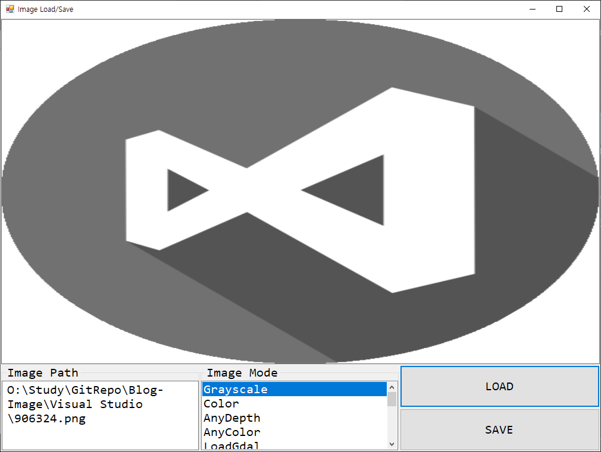

<h1 id="title">C# - OpenCVSharp4 - Image Load / Save</h1>



<h2 id="intro">Introduction</h2>

1. `OpenCVSharp4`[^footnote1]을 이용해 image를 불러오고 저장한다.
2. 사용 시 메모리 누수 아닌 누수가 발생할 수 있다. 대용량 메모리 사용 시 명시적 초기화 및 GC 호출이 필요하다.
3. 이미지 읽기 사용 시 여러가지 읽기 모드가 지원된다. 읽기 모드는 아래 표 참조
    |Name|Value|Description|
    |---|---|---|
    |Unchanged|-1|Return the loaded image as is (with alpha channel, otherwise it gets cropped)|
    |Grayscale|0|Always convert image to the single channel grayscale image|
    |Color|1|Always convert image to the 3 channel BGR color image|
    |AnyDepth|2|Return 16-bit/32-bit image when the input has the corresponding depth, otherwise convert it to 8-bit|
    |AnyColor|4|The image is read in any possible color format|
    |LoadGdal|8|Use the GDAL driver for loading the image<br>* GDAL driver : GDAL is a translator library for raster and vector geospatial data formats that is released under an MIT style Open Source License by the Open Source Geospatial Foundation[^footnote2]|
    |ReducedGrayscale2|16|Always convert image to the single channel grayscale image and the image size reduced 1/2|
    |ReducedColor2|17|Always convert image to the 3 channel BGR color image and the image size reduced 1/2|
    |ReducedGrayscale4|32|Always convert image to the single channel grayscale image and the image size reduced 1/4|
    |ReducedColor4|33|Always convert image to the 3 channel BGR color image and the image size reduced 1/4|
    |ReducedGrayscale8|64|Always convert image to the single channel grayscale image and the image size reduced 1/8|
    |ReducedColor8|65|Always convert image to the 3 channel BGR color image and the image size reduced 1/8|
    |IgnoreOrientation|128|Do not rotate the image according to EXIF's orientation flag<br>* EXIF : Exchangeable image file format (officially Exif, according to JEIDA/JEITA/CIPA specifications) is a standard that specifies formats for images, sound, and ancillary tags used by digital cameras (including smartphones), scanners and other systems handling image and sound files recorded by digital cameras[^footnote3]|

<br><br>

<h2 id="code">Code</h2>

```csharp
using System;
using System.Windows.Forms;
using OpenCvSharp;

namespace ImageLoadSave
{
    public partial class MainFrame : Form
    {
        Mat LoadImage = new Mat();  // OpenCVSharp 객체

        public MainFrame()
        {
            InitializeComponent();
            LoadButton.Click += LoadButton_Click;
            SaveButton.Click += SaveButton_Click;
            ImageMode.Items.AddRange(Enum.GetNames(typeof(ImreadModes)));
            ImageMode.SelectedIndex = 0;
        }

        private void LoadButton_Click(object sender, EventArgs e)
        {
            LoadImage.Release();    // 메모리 누수 발생으로 명시적 초기화 권장
            GC.Collect();
            GC.WaitForPendingFinalizers();  // 메모리 사용량이 대용량인 경우 즉시 GC에서 메모리 수거하도록

            OpenFileDialog dialog = new OpenFileDialog();
            dialog.Filter = "All files|*.*";
            dialog.InitialDirectory = $@"C:\";
            dialog.CheckPathExists = true;
            dialog.CheckFileExists = true;
            if (dialog.ShowDialog() == DialogResult.OK)
            {
                // 이미지 로드
                LoadImage = Cv2.ImRead(dialog.FileName, (ImreadModes)Enum.Parse(typeof(ImreadModes), ImageMode.SelectedItem.ToString()));
                ImagePath.Text = dialog.FileName;

                // PictureBox에 이미지 할당. OpenCvSharp4.Extensions 설치 필요
                PictureView.Image = OpenCvSharp.Extensions.BitmapConverter.ToBitmap(LoadImage);
            }
        }

        private void SaveButton_Click(object sender, EventArgs e)
        {
            SaveFileDialog dialog = new SaveFileDialog();
            dialog.Filter = "Bitmap file|*.bmp";
            dialog.InitialDirectory = $@"C:\";
            dialog.CheckPathExists = true;
            dialog.AddExtension = true;
            if (dialog.ShowDialog() == DialogResult.OK)
            {
                // 이미지 저장
                Cv2.ImWrite(dialog.FileName, LoadImage);
            }
        }
    }
}
```

<br><br>

[^footnote1]: [shimat - opencvsharp](https://github.com/shimat/opencvsharp)

[^footnote2]: [GDAL](https://gdal.org/)

[^footnote3]: [EXIF](https://en.wikipedia.org/wiki/Exif)