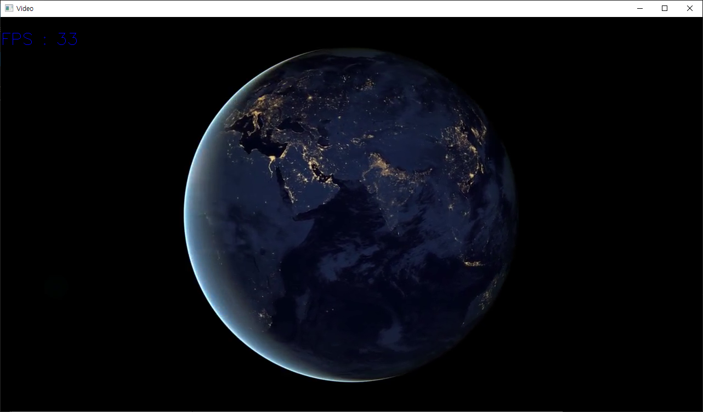

<h1 id="title">C# - OpenCVSharp4 - Text rendering (ex : FPS write)</h1>

<br>

<h2 id="intro">Introduction</h2>

1. `Cv2.PutText()`를 이용해 이미지 또는 비디오에 글자를 출력한다.
2. 좌측 상단 또는 좌측 하단을 원점으로 하여 원하는 위치에 글자를 출력한다.
3. 폰트, 크기 등을 취향에 맞게 선택할 수 있다.
4. 아래 예제는 [C# - OpenCVSharp4 - Video Load / Save](https://peponi-paradise.tistory.com/entry/C-OpenCVSharp4-Video-Load-Save)의 비디오 출력 코드를 활용한다.

<br><br>

<h2 id="code">Code</h2>

```csharp
using OpenCvSharp;
using System;
using System.Collections.Generic;
using System.Threading;
using System.Windows.Forms;

namespace TextingOnFrame
{
    /// <summary>
    /// FPS를 계산할 클래스
    /// </summary>
    public class FPS
    {
        private List<DateTime> Counter = new List<DateTime>();

        public int Get()
        {
            // 1초 이상 지난 항목 제거
            Counter.RemoveAll(frame => frame.AddSeconds(1) < DateTime.Now);

            // 카운트 올린 후 리턴
            Counter.Add(DateTime.Now);
            return Counter.Count;
        }
    }

    public partial class MainFrame : Form
    {
        public MainFrame()
        {
            InitializeComponent();
            LoadButton.Click += LoadButton_Click;
        }

        private void LoadButton_Click(object sender, EventArgs e)
        {
            OpenFileDialog dialog = new OpenFileDialog();
            dialog.Filter = "All files|*.*";
            dialog.InitialDirectory = $@"C:\";
            dialog.CheckPathExists = true;
            dialog.CheckFileExists = false;
            if (dialog.ShowDialog() == DialogResult.OK)
            {
                // 동영상 로드
                var video = new VideoCapture(dialog.FileName);
                VideoPath.Text = dialog.FileName;

                // 동영상 재생
                var videoThread = new Thread(new ParameterizedThreadStart(PlayMethod_OpenCVUI));
                videoThread.IsBackground = true;
                videoThread.Start(video);
            }
        }

        private void PlayMethod_OpenCVUI(object videoCapture)
        {
            var video = videoCapture as VideoCapture;
            var FPS = new FPS();

            double frameIntervalBase = 1000 / video.Fps - 15.6;
            int frameInterval_ms = frameIntervalBase > 0 ? (int)frameIntervalBase : 0;

            Window window = new Window("Video");

            while (true)
            {
                var image = new Mat();
                video.Read(image);
                if (image.Empty()) break;
                Cv2.PutText(image, $"FPS : {FPS.Get()}", new Point(0, 50), HersheyFonts.HersheySimplex, 1, Scalar.Blue);    // FPS 출력

                window.ShowImage(image);

                Cv2.WaitKey(frameInterval_ms);
                image.Release();
            }

            video.Release();
            window.Close();
            GC.Collect();
        }
    }
}
```

<br><br>

<h2 id="Cv2PutText">참조 자료 - Cv2.PutText()</h2>

<br>

```csharp
    /// <summary>
    /// renders text string in the image
    /// </summary>
    /// <param name="img">Image.</param>
    /// <param name="text">Text string to be drawn.</param>
    /// <param name="org">Bottom-left corner of the text string in the image.</param>
    /// <param name="fontFace">Font type, see #HersheyFonts.</param>
    /// <param name="fontScale">Font scale factor that is multiplied by the font-specific base size.</param>
    /// <param name="color">Text color.</param>
    /// <param name="thickness">Thickness of the lines used to draw a text.</param>
    /// <param name="lineType">Line type. See #LineTypes</param>
    /// <param name="bottomLeftOrigin">When true, the image data origin is at the bottom-left corner.
    /// Otherwise, it is at the top-left corner.</param>
    public static void PutText(InputOutputArray img, string text, Point org,
        HersheyFonts fontFace, double fontScale, Scalar color,
        int thickness = 1, LineTypes lineType = LineTypes.Link8, bool bottomLeftOrigin = false)
    {
        if (img == null)
            throw new ArgumentNullException(nameof(img));
        if (string.IsNullOrEmpty(text))
            throw new ArgumentNullException(text);
        img.ThrowIfDisposed();

        NativeMethods.HandleException(
            NativeMethods.imgproc_putText(img.CvPtr, text, org, (int) fontFace, fontScale, color,
                thickness, (int) lineType, bottomLeftOrigin ? 1 : 0));

        img.Fix();
        GC.KeepAlive(img);
    }
```

<br>

|HersheyFonts|Value|Description|
|---|---|---|
|HersheySimplex|0|normal size sans-serif font|
|HersheyPlain|1|small size sans-serif font|
|HersheyDuplex|2|normal size sans-serif font (more complex than HERSHEY_SIMPLEX)|
|HersheyComplex|3|normal size serif font|
|HersheyTriplex|4|normal size serif font (more complex than HERSHEY_COMPLEX)|
|HersheyComplexSmall|5|smaller version of HERSHEY_COMPLEX|
|HersheyScriptSimplex|6|hand-writing style font|
|HersheyScriptComplex|7|more complex variant of HERSHEY_SCRIPT_SIMPLEX|
|Italic|16|flag for italic font|

<br>

|LineTypes|Value|Description|
|---|---|---|
|Link8|8|8-connected line.|
|Link4|4|4-connected line.|
|AntiAlias|16|Anti-aliased line.|

<br><br>