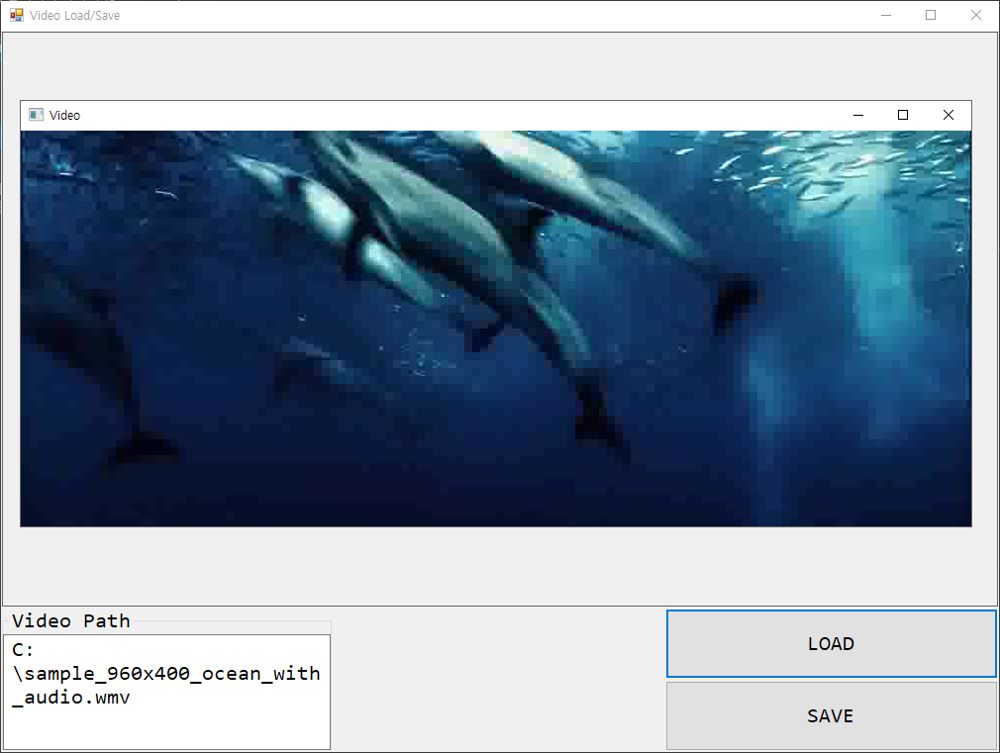

<h1 id="title">C# - OpenCVSharp4 - Video Load / Save</h1>



<h2 id="intro">Introduction</h2>

1. `OpenCVSharp4`을 이용해 video를 불러오고 저장한다.
2. Video 재생 시 프레임 단위로 로드하여 화면에 갱신한다.
3. Video를 파일로 내보낼 시 역시 프레임 단위로 읽고 파일에 쓴다.
4. OpenCvSharp.Extensions.BitmapConverter.ToBitmap 사용 시 Bitmap 변환 과정에서 메모리 누수가 발생할 수 있다. GC 호출이 필요하다.
5. Video의 마지막 프레임 판단을 위해 *PosFrames를 카운팅 하는 대신* 읽은 프레임이 비었는지 확인하는게 성능상 좋다.
6. 프레임을 UI에 뿌리는 과정은 UI 쓰레드를 바쁘게한다. 가능하면 읽어오는 로직은 별도 쓰레드로 구현한다.

<br><br>

<h2 id="code">Code</h2>

```csharp
using System;
using System.Threading;
using System.Windows.Forms;
using OpenCvSharp;

namespace VideoLoadSave
{
    public partial class MainFrame : Form
    {
        VideoCapture Video = new VideoCapture();
        SynchronizationContext SyncContext;

        public MainFrame()
        {
            InitializeComponent();
            SyncContext = SynchronizationContext.Current;
            LoadButton.Click += LoadButton_Click;
            SaveButton.Click += SaveButton_Click;
        }

        private void LoadButton_Click(object sender, EventArgs e)
        {
            OpenFileDialog dialog = new OpenFileDialog();
            dialog.Filter = "All files|*.*";
            dialog.InitialDirectory = $@"C:\";
            dialog.CheckPathExists = true;
            dialog.CheckFileExists = false;
            if (dialog.ShowDialog() == DialogResult.OK)
            {
                Video.Release();

                // 동영상 로드
                Video = new VideoCapture(dialog.FileName);
                VideoPath.Text = dialog.FileName;

                // 동영상 재생
                var videoThread = new Thread(PlayMethod_OpenCVUI);
                videoThread.IsBackground = true;
                videoThread.Start();
            }
        }

        private void SaveButton_Click(object sender, EventArgs e)
        {
            SaveFileDialog dialog = new SaveFileDialog();
            dialog.Filter = "All files|*.*";
            dialog.InitialDirectory = $@"C:\";
            dialog.CheckPathExists = true;
            dialog.AddExtension = true;
            if (dialog.ShowDialog() == DialogResult.OK && Video.IsOpened()) WriteMethod(dialog.FileName);   // Save last load video
            else MessageBox.Show("Could not save");
        }

        void PlayMethod_PictureBox()
        {
            double frameIntervalBase = 1000 / Video.Fps - 15.6;  // 15.6 : 윈도우 타이머 해상도. 초당 프레임 수 최대한 맞춰주기 위한 꼼수
            int frameInterval_ms = frameIntervalBase > 0 ? (int)frameIntervalBase : 0;
            int GCCallCount = 0;

            var image = new Mat();

            // Frame position 증가시키면서 while loop를 돌리는 방법은 좋지 않아 보임.
            // Video.PosFrames를 증가시킬 때, array 재배열이 일어나는 것 같다. 굉장히 느리게 화면이 갱신됨
            //while (Video.PosFrames++!=Video.FrameCount)
            while (true)
            {
                Video.Read(image);
                if (image.Empty()) break;   // 마지막 프레임까지 읽은 경우 여기서 break 걸림
                var frame = OpenCvSharp.Extensions.BitmapConverter.ToBitmap(image);     // OpenCvSharp4.Extensions 설치 필요. Bitmap 변환 과정에서 메모리 누수 발생. GC 호출 필요

                // Post로 화면 갱신을 하는 경우, 프레임이 잘릴 수 있다 (화면에 그리기 전 다음 프레임 로드될 수 있음)
                SyncContext.Post(delegate { PictureView.Image = frame; }, null);

                Thread.Sleep(frameInterval_ms);

                if (GCCallCount++ > 60)
                {
                    GC.Collect();
                    GC.WaitForPendingFinalizers();      // 컬렉팅 끝날 때까지 대기
                    GCCallCount = 0;
                }
            }

            GC.Collect();
        }

        /// <summary>
        /// OpenCV 제공 UI 사용시 CPU 사용량도 낮고, 로직도 단순해짐.
        /// 가능하면 OpenCV UI 사용 권장
        /// </summary>
        void PlayMethod_OpenCVUI()
        {
            double frameIntervalBase = 1000 / Video.Fps - 15.6;
            int frameInterval_ms = frameIntervalBase > 0 ? (int)frameIntervalBase : 0;

            Window window = new Window("Video");    // 비디오 띄울 OpenCV 윈도우

            while (true)
            {
                var image = new Mat();
                Video.Read(image);
                if (image.Empty()) break;

                window.ShowImage(image);

                Cv2.WaitKey((int)frameInterval_ms);
                image.Release();    // 리소스 명시적 해제. 안해주면 메모리 사용량 지속 증가
            }

            window.Close();
            GC.Collect();
        }

        void WriteMethod(string fileName)
        {
            // 동영상 쓰기 객체. 비디오 형식에 따라 코덱 필요
            VideoWriter writer = new VideoWriter(fileName, VideoWriter.FourCC(Video.FourCC), Video.Fps, new OpenCvSharp.Size(Video.FrameWidth, Video.FrameHeight));

            var image = new Mat();

            // 한 프레임씩 순차 쓰기
            while (true)
            {
                Video.Read(image);
                if (image.Empty()) break;

                writer.Write(image);
                image.Release();
            }

            MessageBox.Show("Save done");

            writer.Release();
            GC.Collect();
        }
    }
}
```

<br><br>