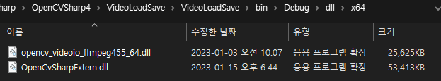
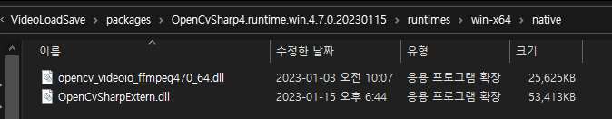

<h1 id="title">C# - OpenCVSharp4 - opencv_videoio_ffmpeg470.dll Error</h1>

 

<h2 id="intro">Introduction</h2>

1. `OpenCVSharp4`을 이용해 video를 읽는 경우, 비디오 재생이 불가한 경우가 있다.
2. `OpenCVSharp4 4.7.0` nuget을 받을 경우 프로그래밍은 정상적으로 진행되나, 컴파일 시 bin 폴더에 `다른 버전의 dll`이 들어가 문제가 발생하는 경우가 있다. 아래 그림에서 보면, ffmpeg dll이 `470이 아니라 455`가 들어가있다.  
     
3. 해당 문제는 빌드 후 `dll 카피 과정`에서 문제가 있는 것으로 파악된다. (`packages` 폴더에는 정상적으로 들어가 있다)
4. 만일 ffmpeg 파일 오류로 인해 비디오 재생이 진행되지 않는 경우라면, 아래 그림 및 경로를 참조하여 bin 폴더에 복사한다.  
     
   - Solution folder\packages\OpenCvSharp4.runtime.win.4.7.0.20230115\runtimes\\`win-x64 or win-x86`\native\opencv_videoio_ffmpeg470_64.dll
   - (컴파일 옵션 64비트/32비트 선택에 따라 runtimes 이하 폴더 탐색)  
5. 따로 다운로드가 필요한 경우, 아래 경로에서 다운받으면 된다. 
   [opencv_videoio_ffmpeg470 & opencv_videoio_ffmpeg470_64 dll download](https://github.com/peponi-paradise/C-Sharp/tree/main/OpenCVSharp4/opencv_videoio_ffmpeg470.dll%20error)

  