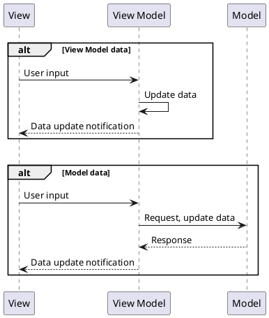

# MVVM 구조의 이해

 

## 1. MVVM?

 

### 1.1. MVVM의 구성 요소

 

 

|항목|내용|비고|
|:---:|---|---|
|View|1. 사용자 화면 2. 순수 UI 요소 제어 :   - 윈도우 이동 등||
|View Model|1. View의 프리젠테이션 로직 :   - UI 이벤트의 진입점  - 컴포넌트 표시를 위한 format 변환  - 화면 전환 2. UI 바인딩 :   - 객체 데이터를 UI에 연결  - 뷰의 상태 제어를 위한 데이터||
|Model|1. SW 구동에 필요한 데이터 제공 2. 데이터 제어 로직 구성||

  

### 1.2. MVVM GUI 구동 시나리오

 

<table>
<td>

</td>
<td>

1. 사용자 입력
2. 뷰모델 커맨드 실행
3. 데이터 요청 또는 업데이트 
    (View Model or Model)
4. 뷰에 데이터 변경 알림
</td>
</table>

  

## 2. Pros & Cons of MVVM

 

### 2.1. Pros

 

1. SW 설계 자유도 증가 : 수평 / 수직 / 혼합 구조 모두 가능
2. 동시 작업성 증가 : SW 파편화로 동시 작업성 증가
3. 뷰, 모델의 재사용성 증가 : 뷰와 제어 로직 분리
4. 단위 테스트 용이 : 뷰 따로, 모델 따로 테스트 가능
5. 다양한 플랫폼에 적용 가능 : Desktop, Mobile, Web...

  

### 2.2. Cons

 

1. MVVM 패턴의 정의 : 넓은 범위에서의 정의로 인해 사람 / 플랫폼마다 구현 범위에 대한 인식이 다름
2. SW 설계 복잡도 증가 : 설계 자유도의 증가로 인한 반대급부 현상
3. Learning curve : 기본적인 프로그래밍 언어 외 SW 패턴에 대한 학습 필요
4. 느슨해진 SW 결합으로 인한 로직 파악이 난해할 수 있음
5. 작업 시간 증가 : 바인딩 로직 등이 필요하여 SW 제작 기간이 늘어날 수 있음
6. MVVM 패턴의 한계 : 기본적인 MVVM 패턴만을 이용할 때 나타나는 한계 - 반복 코드, 재사용 불가 뷰모델 등의 문제가 나타날 수 있다.

  

## 3. 3rd Party 

 

- 상기 단점을 보완하기 위해, 여러 종류의 써드파티 라이브러리가 존재한다.
    - [Communmity toolkit](https://learn.microsoft.com/ko-kr/dotnet/communitytoolkit/mvvm/)
        1. 마이크로소프트에서 제공하는 MVVM 툴킷으로 가장 많은 유저를 보유하고 있다.
        2. 꼭 필요한 MVVM 기능 위주의 제공
    - [DevExpress MVVM](https://docs.devexpress.com/WPF/15112/mvvm-framework)
        1. DevExpress에서 제공하는 MVVM 툴킷으로, MIT 라이선스로 무료 사용이 가능하다.
        2. 메시징 서비스가 강력하고, 다른 라이브러리와 호환 기능을 제공한다.
        3. Winform에서 MVVM 구현 시 가장 사용하기 좋다.
    - [Prism](https://prismlibrary.com/docs/index.html)
        1. Discover, Injection이 강력한 라이브러리로, 툴킷보다는 프레임워크에 가깝다.
        2. 다양한 커스터마이징으로 인해 부트스트래퍼 구현이 용이하다.
        3. 프레임워크에 가까운만큼 추가적인 러닝커브가 필요하다 (그러나 예제가 굉장히 불친절하다).
    - [Caliburn.Micro](https://github.com/Caliburn-Micro/Caliburn.Micro)
        1. MV* 패턴을 염두에 둔 프레임워크로, 여러 패턴에 유연하게 적용 가능하다.
        2. 자동화 구현이 잘 되어있고(패턴매칭에 기반한 오토바인딩), 예제가 친절하여 Prism에 비해 러닝커브가 작다.
        3. 사용자의 평은 좋지만, 수가 적다. (`Microsoft Prism` vs `Jetbrains Caliburn`)
- 사용자의 필요에 따라, 여러 라이브러리를 조합하여 사용하기도 한다. (ex : `Prism` + `Community toolkit`)
- 사용할 MVVM 도구의 사전 선정이 필요하다. SW 코드 및 구조가 다르게 되는 경우가 있기 때문에, 개발 도중 전환을 하게 되는 경우 상당한 작업을 요구할 수 있다.

  

## 4. Advanced structure of MVVM

 

### 4.1. 추가 요소 도입

 

- 좋은 MVVM 패턴을 구성하고 사용하기 위해 추가 요소가 도입될 수 있다. 아래는 몇몇 예시를 소개한다.
    1. [Dependency Injection](https://ko.wikipedia.org/wiki/%EC%9D%98%EC%A1%B4%EC%84%B1_%EC%A3%BC%EC%9E%85) : SW의 결합을 더욱 느슨하게 해준다. 일반적으로 `Discover` 또는 `Injection` 방식으로 구현된다.
    2. [Inversion of Control](https://en.wikipedia.org/wiki/Inversion_of_control) : DI와 밀접하게 움직인다. 라이브러리가 사용자의 코드를 참조하는 형태로 구현되어, 객체 생성 및 관리를 클래스 외부에 위임하는 것이 가능해진다. 주로 컨테이너의 형태로 구현된다.
    3. Service : `View model`에서의 `View component` 참조, `Model`의 반복 코드 발생 등의 문제를 해결하기 위해 도입된다. 반복적으로 사용되는 기능을 Service로 묶어 모듈 형태로 사용 가능하게 한다. `IOC`의 컨테이너와 같이 물려 기능하는 경우가 많다.
    4. [Messaging](https://learn.microsoft.com/en-us/dotnet/communitytoolkit/mvvm/messenger) : MVVM 패턴에서 나타나는 관계의 단절을 해결하기 위해 도입된다. `View model - View model`, `Model - Service` 등의 커뮤니케이션 기능을 수행한다.
    5. [Bootstrapper](https://en.wikipedia.org/wiki/Bootstrapping) : SW의 초기화와 관련되어있다. DI 매핑, IOC 컨테이너의 객체 수명 관리 설정 등 SW 운영과 관련된 초기화 작업을 수행한다.
- 상기 요소 외에도 많은 개념들이 도입될 수 있다.

  

## 5. Code example

 

- 첨부 솔루션(`PrismAppSample.sln`)은 수평 구조의 WPF MVVM application에 관한 예시이다. (Prism)