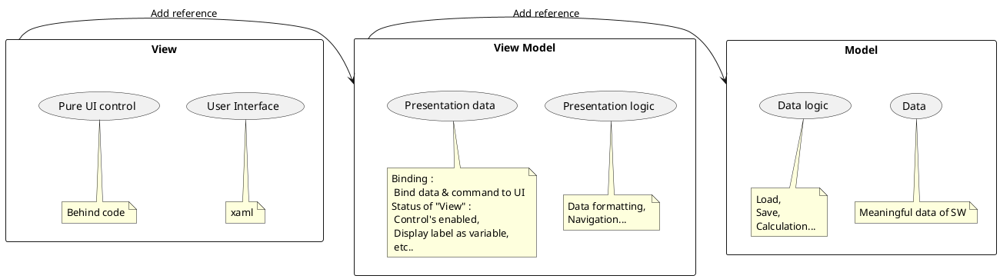
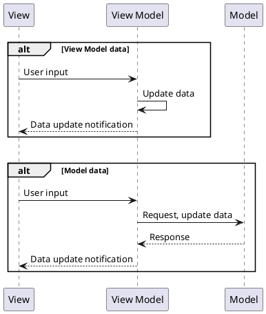

# MVVM 구조의 이해

## 1. MVVM?

### 1.1. MVVM의 구성 요소

|항목|내용|비고|
|:---:|---|---|
|View|1. 사용자 화면 2. 순수 UI 요소 제어 :   - 윈도우 이동 등||
|View Model|1. View의 프리젠테이션 로직 :   - UI 이벤트의 진입점  - 컴포넌트 표시를 위한 format 변환  - 화면 전환 2. UI 바인딩 :   - 객체 데이터를 UI에 연결  - 뷰의 상태 제어를 위한 데이터||
|Model|1. SW 구동에 필요한 데이터 제공 2. 데이터 제어 로직 구성||

### 1.2. MVVM GUI 구동 시나리오

<table>
<td>

</td>
<td>

1. 사용자 입력
2. 뷰모델 커맨드 실행
3. 데이터 요청 또는 업데이트 
    (View Model or Model)
4. 뷰에 데이터 변경 알림
</td>
</table>

### 1.3. 구조 사용 시 이점

