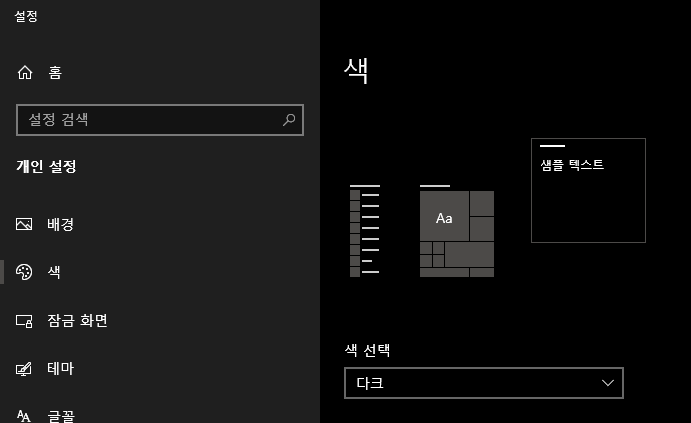

## Introduction

<br>



- 상기 그림과 같이, 윈도우에는 색 모드를 설정할 수 있는 옵션이 있다.
- 다음은 코드를 이용해 `윈도우 색 모드 설정값`을 얻어오는 방법이다.
- 레지스트리를 통해 현재 설정값을 판단한다.
    |값|설명|
    |--|---|
    |-1|레지스트리 미발견|
    |0|다크|
    |1|라이트|

<br>

## Code

<br>

```cs
using Microsoft.Win32;

namespace WindowTheme
{
    public static class WindowThemeColor
    {
        public static bool IsDarkTheme()
        {
            // 1은 라이트, 0은 다크, -1은 못찾았음
            int res = (int)Registry.GetValue($"HKEY_CURRENT_USER\SOFTWARE\Microsoft\Windows\CurrentVersion\Themes\Personalize", "AppsUseLightTheme", -1);
            return res == 0;
        }
    }
}
```