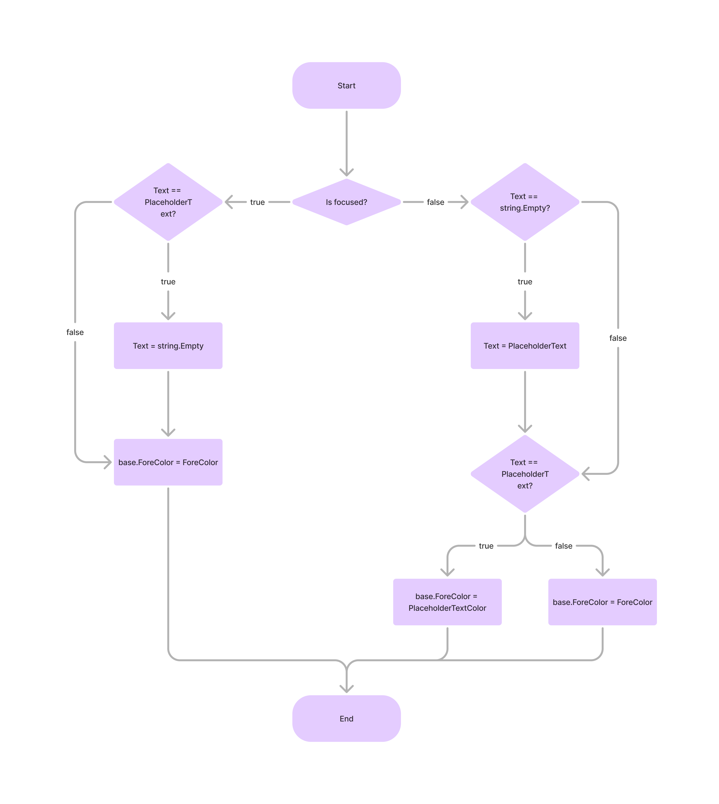

## 1. Introduction

<br>

- `.NET 5` 이상의 버전에서 Winform의 [TextBox](https://learn.microsoft.com/ko-kr/dotnet/api/system.windows.forms.textbox?view=windowsdesktop-8.0)는 [PlaceholderText](https://learn.microsoft.com/ko-kr/dotnet/api/system.windows.forms.textbox.placeholdertext?view=windowsdesktop-8.0#system-windows-forms-textbox-placeholdertext) 속성을 통해 `placeholder`를 자체적으로 지원한다.
    
- `.Net framework`의 [TextBox](https://learn.microsoft.com/ko-kr/dotnet/api/system.windows.forms.textbox?view=netframework-4.8.1)는 `placeholder`를 지원하지 않는데, 필요한 경우 `TextBox`를 상속받아 직접 구현할 필요가 있다.
- 다음은 `placeholder`를 구현한 TextBox의 예시이며, 다음과 같은 기능을 한다.
    1. Placeholder text 설정
    2. Placeholder text color 설정

<br>

## 2. Example

<br>

- 여기서 구현하는 `placeholder`는 다음과 같이 동작한다.
    [](https://www.figma.com/board/Y4wrxM5T8t8oPU4F9QXgyn/PlaceholderTextBox?node-id=0-1&t=h8dTYeWdBss8Vhrd-1)
- 이를 구현하면 다음과 같은 코드로 나타낼 수 있다.
    ```cs
    using System.ComponentModel;
    using System.Drawing;
    using System.Windows.Forms;

    namespace PlaceholderTextBoxControl
    {
        public class PlaceholderTextBox : TextBox
        {
            [Category("Placeholder")]
            [Description("Set placeholder text")]
            public string PlaceholderText
            {
                get => _placeholderText;
                set
                {
                    UpdateText(true);
                    _placeholderText = value;
                    UpdateText(false);
                }
            }

            [Category("Placeholder")]
            [Description("Set placeholder text color")]
            public Color PlaceholderTextColor
            {
                get => _placeholderColor;
                set
                {
                    _placeholderColor = value;
                    UpdateColor();
                }
            }

            [Category("Appearance")]
            [Description("A Color that represents the control's foreground color.")]
            public new Color ForeColor
            {
                get => _foreColor;
                set
                {
                    _foreColor = value;
                    UpdateColor();
                }
            }

            private string _placeholderText = "Input text";
            private Color _placeholderColor = Color.DarkGray;
            private Color _foreColor = SystemColors.WindowText;

            public PlaceholderTextBox()
            {
                GotFocus += (s, e) => { UpdateSetting(); };
                LostFocus += (s, e) => { UpdateSetting(); };
                TextChanged += (s, e) => { UpdateSetting(); };

                UpdateText();
                UpdateColor();
            }

            private void UpdateSetting()
            {
                UpdateText(Focused);
                UpdateColor();
            }

            private void UpdateText(bool focused = false)
            {
                if (focused && string.Equals(Text, PlaceholderText))
                    Text = string.Empty;
                else if (!focused && string.IsNullOrWhiteSpace(Text))
                    Text = PlaceholderText;
            }

            private void UpdateColor()
            {
                if (Focused)
                    base.ForeColor = ForeColor;
                else
                {
                    if (string.Equals(Text, PlaceholderText))
                        base.ForeColor = PlaceholderTextColor;
                    else
                        base.ForeColor = ForeColor;
                }
            }
        }
    }
    ```
- 결과적으로, 디자이너 및 런타임에 `PlaceholderText`가 다음과 같이 표현된다.
    

<br>

## 3. 참조 자료

<br>

- [TextBox - .Net 8](https://learn.microsoft.com/ko-kr/dotnet/api/system.windows.forms.textbox?view=windowsdesktop-8.0)
- [TextBox - .Net framework 4.8.1](https://learn.microsoft.com/ko-kr/dotnet/api/system.windows.forms.textbox?view=netframework-4.8.1)