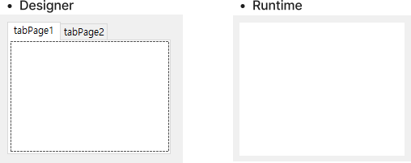

## 1. Introduction

<br>

- `TabControl`은 탭으로 구성된 패널 기능을 제공한다.
    
- 간혹 탭페이지를 사용하면서 탭은 필요가 없는 경우가 발생하는데, `Win32`의 [TCM_ADJUSTRECT 메시지](https://learn.microsoft.com/ko-kr/windows/win32/controls/tcm-adjustrect)를 통해 탭을 제거할 수 있다.
- Microsoft 문서에서는 `TCM_ADJUSTRECT`에 대해 다음과 같이 소개한다.
    > 창 사각형이 지정된 탭 컨트롤의 표시 영역을 계산하거나 지정된 표시 영역에 해당하는 창 사각형을 계산합니다. 이 메시지를 명시적으로 보내거나 [TabCtrl_AdjustRect](https://learn.microsoft.com/ko-kr/windows/win32/api/commctrl/nf-commctrl-tabctrl_adjustrect) 매크로를 사용하여 보낼 수 있습니다.

<br>

## 2. Tabless TabControl

<br>

- 탭을 제거하기 위해 `WndProc(ref Message)`를 오버라이드 한다.
    ```cs
    public class TablessTabControl : TabControl
    {
        protected override void WndProc(ref Message windowMessage)
        {
            // Catch the `TCM_ADJUSTRECT` message
            // Check `DesignMode` for designer usage
            if (windowMessage.Msg == 0x1328 && !DesignMode)
            {
                windowMessage.Result = 1;
            }
            else base.WndProc(ref windowMessage);
        }
    }
    ```
- Designer와 실행 화면은 다음과 같이 나타난다.
    

<br>

## 3. Custom TabControl 구현 예시

<br>

- 위에서 구현한 탭 제거와 더불어 약간의 기능 추가를 하여 다음과 같이 구현할 수 있다.
    ```cs
    using System.ComponentModel;
    using System.Threading;
    using System.Windows.Forms;

    namespace CustomTabControlExample
    {
        public class CustomTabControl : TabControl
        {
            [Description("Show / hide tab"), Category("Behavior")]
            public bool ShowTab { get; set; } = true;

            private SynchronizationContext _synchronizationContext;

            public CustomTabControl()
            {
                // Get UI thread's synchronization context
                _synchronizationContext = SynchronizationContext.Current!;
            }

            protected override void WndProc(ref Message windowMessage)
            {
                if (ShowTab)
                {
                    base.WndProc(ref windowMessage);
                }
                else
                {
                    // Catch the `TCM_ADJUSTRECT` message
                    // Check `DesignMode` for designer usage
                    if (windowMessage.Msg == 0x1328 && !DesignMode)
                    {
                        windowMessage.Result = 1;
                    }
                    else base.WndProc(ref windowMessage);
                }
            }

            public void AddTab(string name)
            {
                _synchronizationContext.Post(delegate
                {
                    TabPages.Add(name, name);
                    if (TabPages.Count == 1) SelectTab(name);
                }, null);
            }

            public void AddTab(TabPage page)
            {
                _synchronizationContext.Post(delegate
                {
                    TabPages.Add(page);
                    if (TabPages.Count == 1) SelectTab(page);
                }, null);
            }

            public void RemoveTab(string name)
            {
                _synchronizationContext.Post(delegate
                {
                    TabPages.RemoveByKey(name);
                }, null);
            }

            public void RemoveTab(TabPage page)
            {
                _synchronizationContext.Post(delegate
                {
                    TabPages.Remove(page);
                }, null);
            }

            public void ClearTabs()
            {
                _synchronizationContext.Post(delegate
                {
                    TabPages.Clear();
                }, null);
            }

            public void NextTab()
            {
                _synchronizationContext.Post(delegate
                {
                    if (SelectedIndex >= TabPages.Count - 1) return;
                    SelectTab(SelectedIndex + 1);
                }, null);
            }

            public void PreviousTab()
            {
                _synchronizationContext.Post(delegate
                {
                    if (SelectedIndex <= 0) return;
                    SelectTab(SelectedIndex - 1);
                }, null);
            }

            public TabPage? this[int index]
            {
                get
                {
                    if (TabPages.Count > 0) return TabPages[index];
                    return null;
                }
            }

            public TabPage? this[string name]
            {
                get
                {
                    if (TabPages.ContainsKey(name)) return TabPages[name];
                    return null;
                }
            }
        }
    }
    ```

<br>

## 4. 참조 자료

<br>

- [TabControl 클래스](https://learn.microsoft.com/ko-kr/dotnet/api/system.windows.forms.tabcontrol?view=windowsdesktop-8.0)
- [TCM_ADJUSTRECT 메시지](https://learn.microsoft.com/ko-kr/windows/win32/controls/tcm-adjustrect)